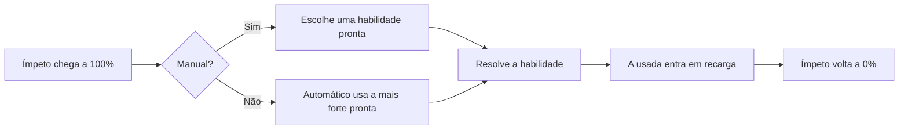
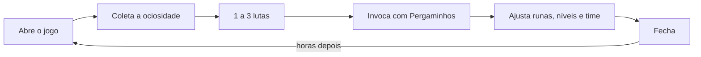

# SIGILOS — Game Design Document

Sep 23, 2026 · @Mikael

> **Revisão de 24/09/2026, depois dos primeiros testes do MVP.** O Erudito e todo o Grimório (páginas, Formas, Círculos, Ressonância) saíram do jogo. A base mecânica e visual passa a ser Summoners War: nível de 1 a 40 por invocação, Despertar com nome próprio e estrelas roxas, runas de 6 espaços. O Éter ficou escasso (só Glifo e inimigo derrubado geram) e é exclusivo do modo manual: o automático nunca o gasta. O jogo ganhou a tela de Monstros e o Compêndio, que explica Glifos, elementos, efeitos, runas e regras.

> **Segunda revisão de 24/09/2026: runas e atributos iguais aos de Summoners War.** Runas e atributos das invocações são a parte mais importante do jogo, então seguem Summoners War em tudo: runas de 1 a 6 estrelas, raridade pelo número de subatributos, melhora até +15 com 4 subatributos, atributo inato, as tabelas de números de lá, custo para tirar runa, Pedra de Afiar e Gema Encantada, e os 16 conjuntos (dois por Glifo). A única diferença: **a melhora de runa nunca falha**; em troca, cada nível custa o preço médio de Summoners War contando as falhas, e o Pó de Sigilo ficou escasso. Os atributos passaram para a escala de lá (uma 5★ no nível 40 tem cerca de 9 mil de Vida), com Crítico 15%, Dano crítico 50%, Resistência 15% e Precisão 0% de base, a curva de Defesa de lá, a Liderança sobre a base e o Despertar com os bônus de lá.

> **Terceira revisão de 24/09/2026.** Os Glifos deixaram de ser coisa das invocações: agora são os 16 símbolos de runa, um por conjunto, e cada um quer dizer a mesma coisa em todo o jogo (Gebo, ×, é atordoar; Algiz, ᛉ, é Defesa). A segunda habilidade virou "Especial". Cada invocação é uma cópia nova (nível 1, sem Despertar), com coleção de 50 vagas e um Baú sem limite; cópias repetidas são fundidas em Ecos ou liberadas em Fragmentos. Lutas são de até 5 contra 5, com uma equipe por conteúdo. As Masmorras entraram: quatro de runas (4 a 6 estrelas, quatro conjuntos cada) e a Forja (Pedras de Afiar e Gemas), que a Campanha deixou de soltar. O Compêndio foi refeito, o Grimório mostra tudo o que existe, e todo texto da interface mora em Data/texts.

> **Quarta revisão de 25/09/2026: Mana, Ouro e Loja.** Farmar runas é o centro do jogo. As entradas de Masmorra viraram **Mana**: toda vitória, na Campanha ou numa Masmorra, custa Mana (a derrota não custa nada), e a canalização recarrega até o máximo (60 no nível 1 da conta, 120 no nível 60). A conta ganhou nível, de 1 a 60, com a experiência de toda vitória. O Pó de Sigilo saiu: a **Essência** paga nível, Despertar e melhora de runa, e cada runa melhorada disputa com os monstros. Entrou o **Ouro**, a moeda rara de gacha comum (canalização, nível da conta, primeira vitória em andar de Masmorra), que a **Loja** troca por Mana ou Pergaminhos; a canalização deixou de dar Pergaminhos. O Violento dá no máximo um turno extra por turno do monstro. Monstros no Baú guardam as runas deles, fora das 800 vagas do inventário de runas.

> **Quinta revisão de 25/09/2026: o jogo passa a ser em inglês.** Ids, nomes de dados (invocações, inimigos, fases, Masmorras, Loja) e todo texto da interface nascem em inglês (Data/texts/en.json); o português vira uma tradução da interface (Data/texts/pt-BR.json). Este documento segue em português, e os nomes daqui são os de design: os do jogo estão em Data/ (Baú é Vault, Ímpeto é Impetus, Éter é Aether, Glifo é Glyph).

> **Sexta revisão de 25/09/2026: inimigos são invocações.** Limo, Goblin, Lobo e Bandido viraram famílias de invocação 3★, o Troll 4★ e o Dragão 5★, cada uma com 5 elementos e Assinatura própria (Corpo Gelatinoso reduz dano; Golpe Baixo bate mais em quem tem efeito negativo; Instinto de Caça bate mais em quem está abaixo da metade da Vida; Emboscada começa cada onda com Ímpeto; Regeneração cura no começo do turno; Fogo de Dragão queima quem acerta). Os inimigos comuns de fases e Masmorras são essas invocações com Vida e Ataque reforçados pela raridade e pela dificuldade do encontro; só os chefes continuam como criaturas únicas. O Grimório agrupa as invocações por família, com os elementos no detalhe. Entrou a **Batalha automática**: até 30 lutas seguidas, como o Resolver, mas cada luta leva o tempo que levaria no automático em 2×. A tela de batalha ficou com duas velocidades, 1× e 2× (o 2× corre três vezes mais rápido). O Éter passou a aprimorar só a habilidade especial: o básico não tem versão aprimorada.

> **Sétima revisão de 26/09/2026: habilidades, estrelas e experiência de Summoners War.** Sem PvP, o Éter não era estratégia: saiu do jogo. A antiga versão aprimorada virou o que o Despertar libera, e o que o Despertar dá segue as estrelas naturais, como lá: as 3★ ganham uma habilidade nova (uma Passiva ou uma ativa), as 4★ uma habilidade mais forte (e algumas uma terceira ativa), as 5★ quase não mudam (só o atributo). O Despertar custa 25 000 de Essência nas 3★, 50 000 nas 4★ e 75 000 nas 5★. A Assinatura virou **Passiva**, e nem todo monstro tem uma: alguns têm uma terceira habilidade ativa no lugar. Os Ecos saíram: cada habilidade tem níveis (mais dano, mais cura, mais chance de efeito ou menos recarga), e fundir uma cópia sobe o nível de uma habilidade sorteada. Toda invocação nasce nas estrelas naturais e **evolui** até 6★ com Essência e Fragmentos quando chega ao nível máximo da estrela (10 + 5 por estrela: 25 no 3★, 40 no 6★), voltando ao nível 1, como lá. A experiência de cada nível é a tabela de Summoners War por estrela, e a experiência de fases e Masmorras segue a escala de lá (de 110 na fase 1 a 2400 no andar 5), com a Essência valendo 10 de experiência. Fases e andares têm estrelas e nível: a Campanha vai de 3★ nível 1 a 5★ nível 30, e as Masmorras de 4★ nível 25 a 6★ nível 35.

## 1. Visão geral

**Sigilos** (título provisório) é um gacha de fantasia para um jogador, offline e sem dinheiro de verdade (a Loja só troca Ouro ganho jogando): você coleciona criaturas, grava sigilos nelas e comanda batalhas por turnos em que as magias são montadas símbolo por símbolo.

Em uma frase: Summoners War: Sky Arena como base mecânica e visual (coleção, nível, Despertar, runas, barra de ataque), o recurso compartilhado de Epic Seven e o ritmo de um AFK. A arte de personagem é rabiscada por escolha visual; o mundo é fantasia levada a sério.

**Objetivo do projeto.** Um jogo que você mesmo abra todo dia por 5 a 15 minutos, durante meses, pelo prazer de montar combinações e ver o time crescer. Critério de sucesso: jogar a versão 1.0 por 90 dias seguidos sem se obrigar.

| Item | Decisão |
| --- | --- |
| Jogadores | 1, offline, save local |
| Plataforma | PC primeiro; Android depois, com o mesmo código |
| Sessão típica | 5 a 15 min, 1 ou 2 vezes por dia |
| Equipe | 1 pessoa, cerca de 8 a 10 h por semana (premissa a confirmar) |
| Tamanho da 1.0 | 40 invocações (8 famílias em 5 elementos), 3 regiões (60 fases), Torre de 60 andares |
| Prazo estimado | MVP jogável em cerca de 3 meses; 1.0 em 9 a 12 meses |

**O que o jogo não é.** Sem monetização, servidor, PvP online, stamina, eventos com prazo, cutscenes ou dublagem. Esses sistemas existem para reter pagantes e custam meses; num projeto pessoal só atrapalham.

## 2. Pilares de design

Toda decisão de sistema passa por estes quatro filtros; o que não serve a nenhum deles sai do escopo.

1. **Magia é linguagem.** Os 16 Glifos são o vocabulário: cada símbolo quer dizer a mesma coisa nas runas, nos efeitos e nos textos. A profundidade vem de combinar poucas peças, não de acumular sistemas.
2. **Velocidade é tática.** Quem age primeiro e quem é atrasado decide a luta; a barra de Ímpeto é a principal camada de estratégia.
3. **Respeite o tempo.** O progresso acontece com o jogo fechado. Nada pune quem ficou dias sem abrir.
4. **Rabisco é estilo, não tema.** A arte é rápida de propósito para o conteúdo crescer; o mundo continua sendo fantasia épica. Nenhum desenho leva mais de 15 minutos.

## 3. O que pegar de cada referência

De cada jogo entra só o que serve aos pilares; o resto é cortado de propósito para caber no tempo de uma pessoa.

| Referência | O que entra | O que fica de fora |
| --- | --- | --- |
| Summoners War: Sky Arena (base mecânica e visual) | Barra de ataque por Velocidade; nível de 1 a 40 por monstro; painéis escuros com moldura dourada; runas em 6 espaços com conjuntos de 2 e 4 peças; famílias de monstros em 5 elementos; Despertar; duplicatas que sobem habilidades; habilidade de líder; masmorras que soltam conjuntos específicos; masmorras secretas por família; arena contra defesa controlada pela IA | Evolução de estrelas com monstros de sacrifício; chance de falha na melhora de runa; conjuntos de runa da Fenda; guerra de guildas, cerco e PvP em tempo real; cristais e pacotes |
| Epic Seven | Almas compartilhadas que turbinam habilidades (viram o Éter); recargas de habilidade; heróis com nome e personalidade; Abismo como torre de desafio | Equipamento separado das runas; artefatos; cutscenes; Labirinto; PvP em tempo real |
| AFK Arena e AFK Journey | Recompensas ociosas; nível compartilhado entre heróis; batalha automática com time preparado; sessões curtas sem stamina | Dezenas de moedas e menus; eventos com prazo; pacotes pagos |
| Tormenta (RPG) | Pagar mana extra por aprimoramentos | Nomes, deuses, lugares e textos do cenário; grimório e círculos de custo (saíram na revisão de 24/09) |

Summoners War e Epic Seven se sobrepõem muito (ordem de turnos, elementos). Summoners War é a base; de Epic Seven fica o recurso compartilhado (Éter).

O mundo e os nomes são originais. Assim o jogo pode ser mostrado a amigos sem nenhuma dúvida de propriedade intelectual.

## 4. Mundo e tom

Neste mundo tudo o que existe foi escrito com dezesseis Glifos primordiais, e conjurar é redesenhá-los. Um Conjurador não cria criaturas: grava um sigilo que as prende a ele por contrato. Você é um Conjurador recém-sagrado de uma ordem quase extinta.

**Conflito.** O Silêncio, uma força sem forma, está desfazendo os Glifos. Onde ele passa, a magia falha e as criaturas se tornam Profanadas, selvagens e hostis. Cada região tem um Conjurador rival que acredita que o Silêncio é a paz.

**Regiões.** Cada região muda uma regra de batalha, o que dá variedade sem exigir arte nova.

| Região | Paisagem | Regra de batalha | Chefe |
| --- | --- | --- | --- |
| 1 | Planície dos Menires | Nenhuma; ensina o básico | O Mestre de Correntes, rival especialista em Laço |
| 2 | Arquipélago Afogado | Maré: a cada 3 rodadas, unidades de Água ganham +20% de Ímpeto | A Serpe-Mãe |
| 3 | Cidadela do Selo Partido | Glifos instáveis: as habilidades começam a luta em recarga | O Arauto do Silêncio |
| Pós-jogo | Torre dos Círculos | Andares com regras fixas, uma por andar | — |

**Tom.** Fantasia épica clássica, séria no mundo e com leveza nas falas. No máximo três falas por fase: a história é tempero, nunca obstáculo entre o jogador e a luta.

## 5. Direção de arte

A arte de personagem é rabiscada por escolha visual e de produção: é o que permite 40 invocações com uma pessoa só. O mundo, os textos e a interface continuam fantasia, e os sigilos são a única arte feita com capricho.

| Elemento | Regra |
| --- | --- |
| Personagens | Traço solto, no papel (foto ou scan) ou no tablet, no máximo 15 minutos. As criaturas são tratadas com seriedade, não como piada |
| Famílias | Um desenho por família, recolorido nos 5 elementos, como em Summoners War. 8 desenhos cobrem as 40 invocações |
| Despertar | Um segundo desenho por família, mais detalhado e colorido: 16 desenhos de criatura na 1.0 |
| Animação | Linha tremida: 3 versões do mesmo desenho alternando a cerca de 8 quadros por segundo. Movimento só por interpolação (avançar, recuar, tremer), nunca quadro a quadro |
| Inimigos | Criaturas clássicas de RPG, como slime, goblin, lobo, bandido, troll, dragão, etc. Todos seriam as criaturas de 1 ou 2 estrelas da pool de invocações. |
| Glifos e runas | Os 16 Glifos são símbolos de runa (futhark antigo, domínio público), um por conjunto; aparecem dourados nos textos ao lado do termo que querem dizer |
| Raridade | 1, 2, 3, 4 ou 5 estrelas. Mas do 3 pra frente com moldura de bronze, prata ou ouro. Estrelas douradas; roxas depois do Despertar |
| Interface | Base de Summoners War: painéis escuros com moldura dourada, fonte serifada nos títulos e fonte limpa nos números |
| Som | Pedra, papel e sussurros de conjuração; música orquestral de biblioteca livre |

**Paleta.** Uma cor forte por elemento (vermelho Fogo, azul Água, verde Vento, dourado Luz, violeta Trevas) sobre fundos neutros de pergaminho e pedra. O elemento se lê antes do desenho.

## 6. Glifos e elementos

Os Glifos são símbolos de runa (o futhark antigo) e o vocabulário do mundo. Cada um é o símbolo de um conjunto de runas e quer dizer a mesma coisa em todo lugar: na runa, no efeito de combate, na ficha de atributos e nos textos, onde aparece dourado ao lado do termo. Onde houver Gebo (×), é atordoar; onde houver Algiz (ᛉ), é Defesa.

O Compêndio, dentro do jogo, explica cada Glifo, elemento, efeito, runa e regra de combate com os números atuais; o Grimório mostra tudo o que existe.

### Os 16 Glifos

| Glifo | Quer dizer | Conjunto de runas |
| --- | --- | --- |
| Uruz | Vida | Energia |
| Raido | Velocidade | Rapidez |
| Algiz | Defesa | Guarda |
| Othalan | Escudo | Escudo |
| Kauna | Precisão | Foco |
| Pertho | Crítico | Lâmina |
| Jeran | Turno extra | Violência |
| Thurisaz | Contra-ataque | Vingança |
| Gebo | Atordoar | Desespero |
| Dagaz | Imunidade | Vontade |
| Sowilo | Dano crítico | Fúria |
| Tiwaz | Ataque | Fatal |
| Iwaz | Resistência | Perseverança |
| Naudiz | Ímpeto | Nêmesis |
| Laukaz | Dreno | Vampiro |
| Haglaz | Destruição | Destruição |

### Elementos

Toda invocação tem um elemento. Fogo vence Vento, Vento vence Água, Água vence Fogo; Luz e Trevas têm vantagem uma sobre a outra. Vantagem dá +25% de dano; desvantagem, −25%.

## 7. Combate

Batalha por turnos sem tabuleiro, como em Summoners War: até 5 monstros contra até 5 inimigos por onda, e cada unidade age quando sua barra de Ímpeto enche. Você vence ao derrotar todas as ondas.

### Montagem do time

Uma equipe de até 5 monstros por conteúdo: uma para a Campanha e uma para cada Masmorra (tela de Equipes). A primeira é a Líder e aplica sua Liderança ao time, se tiver uma. Cada fase tem até 3 ondas, como as masmorras de Summoners War. Na luta, o botão Efeitos mostra o que está sobre cada aliado e inimigo.

### Turno



A barra enche em proporção à Velocidade. Efeitos empurram ou atrasam barras, e a ordem dos turnos no início da luta costuma decidir o resultado: é o ajuste fino de velocidade que os dois jogos têm em comum.

### Habilidades

Como em Summoners War: a primeira habilidade é a básica, sempre pronta; as outras ativas têm recarga em turnos (a recarga conta o turno em que foi usada). Uma Passiva, se houver, age sozinha. O Éter saiu na sétima revisão: sem PvP, não era estratégia.

- **Níveis:** cada habilidade tem de 1 a 5 melhorias (+dano, +cura, +chance de efeito ou −1 de recarga), e cada cópia fundida sobe uma delas, sorteada.
- **Despertar:** a habilidade que muda ao despertar troca os efeitos pelos da versão desperta; a que o Despertar dá só existe no monstro desperto.

### Vitória e derrota

Você vence ao derrotar todas as ondas. Perde se a equipe inteira cair ou se 30 rodadas passarem.

### Automático e manual

Toda luta pode ser automática: usa a habilidade pronta de maior número (a mais forte) e mira com vantagem elemental e, no empate, no mais ferido. No manual, o jogador escolhe a ordem das recargas e o alvo.

Campanha e Masmorras são desenhadas para o automático; Torre e Provações, para o manual. Lutas já vencidas ganham o botão Resolver, que simula na hora.

## 8. Invocações

A 1.0 tem 40 invocações: 8 famílias em 5 elementos, como em Summoners War. Cada variante tem kit próprio e, depois do Despertar, um nome próprio, como os heróis de Epic Seven.

### Anatomia

| Campo | Conteúdo |
| --- | --- |
| Identidade | Família, elemento e papel (Frente, Atacante, Suporte ou Controle) |
| Raridade | 3, 4 ou 5 estrelas naturais, definida pela família; toda invocação evolui até 6★ |
| Atributos | Os de Summoners War: Vida, Ataque, Defesa, Velocidade, Crítico, Dano crítico, Resistência e Precisão (chance de aplicar efeitos) |
| Básica | Habilidade sempre disponível |
| Ativas | Uma ou duas com recarga de 3 a 5 turnos |
| Passiva | Nem todos têm: alguns têm uma terceira ativa no lugar; famílias de 4 e 5 estrelas também têm Liderança |
| Níveis | Cada habilidade sobe com cópias fundidas |
| Despertar | Nome próprio, desenho novo e, pelas estrelas naturais, uma habilidade nova (3★), uma mais forte (4★) ou um atributo (5★) |

### Famílias

| Família | Estrelas | Conceito |
| --- | --- | --- |
| Diabretes de Selo | 3 | Pequenos demônios presos em sigilos de contenção |
| Menires Despertos | 3 | Golens de pedra rúnica que guardam estradas antigas |
| Harpias do Véu | 3 | Caçadoras que se escondem na névoa |
| Cavaleiros Juramentados | 4 | Armaduras vazias movidas por um voto gravado no peito |
| Serpes | 4 | Dragões menores, de voo baixo e humor pior |
| Oráculos de Vidro | 4 | Videntes cujo corpo virou cristal de tanto olhar o futuro |
| Fênix de Cinza | 5 | Aves que renascem das cinzas de um sigilo queimado |
| Sábios Sem Rosto | 5 | Arquimagos que trocaram o próprio rosto por um Glifo |

### Exemplos

| Invocação | Ficha | Básico | Especial (recarga) | Passiva |
| --- | --- | --- | --- | --- |
| Menir Desperto de Água | 3★ · Frente | Golpe de Pedra: 90% de dano e 30% de chance de reduzir o Ataque do alvo. +1 Éter: chance de 60% | Círculo de Pedra (4): escudo de 20% da Vida do Menir em todos os aliados por 2 turnos. +2 Éter: remove também um efeito negativo | Pedra não se move: imune a atraso de Ímpeto e a atordoamento |
| Diabrete de Selo de Fogo | 3★ · Atacante | Faísca: 2 golpes de 55%. +1 Éter: cada golpe tem 30% de chance de Queimadura | Selo Rompido (3): 180% num alvo; se ele cair, o Diabrete age de novo. +2 Éter: ignora 30% da Defesa | +15% de Velocidade enquanto for o aliado com menos Vida |
| Harpia do Véu de Vento | 3★ · Atacante | Rasante: 100% de dano e 25% de chance de Cegueira. +1 Éter: chance de 50% | Penas de Névoa (4): fica Oculta por 1 turno e ganha +30% de Ímpeto. +2 Éter: o aliado com menos Vida também fica Oculto | Ao esquivar, contra-ataca com Rasante |
| Cavaleiro Juramentado de Luz | 4★ · Frente | Juramento: 100% de dano e 30% de chance de Provocar. +1 Éter: Provocar garantido | Voto de Escudo (4): provoca todos os inimigos por 1 turno e recebe −40% de dano por 2 turnos. +2 Éter: provocação de 2 turnos | Liderança: +20% de Defesa. Ao cair, dá escudo de 15% da Vida a todos os aliados |
| Serpe de Trevas | 4★ · Controle | Mordida Vil: 110% de dano, drena 30% como Vida. +1 Éter: −50% de cura no alvo por 2 turnos | Hálito de Túmulo (3): 80% em todos, 50% de chance de Maldição (+25% de dano recebido) por 2 turnos. +2 Éter: chance de 100% | Sempre que um inimigo cai, recupera 15% da Vida e gera 1 Éter |
| Oráculo de Vidro de Água | 4★ · Suporte | Visão Fria: 90% de dano e atrasa o Ímpeto do alvo em 15%. +1 Éter: atrasa 30% | Profecia (4): todos os aliados ganham +25% de Ímpeto. +2 Éter: e +15% de Velocidade por 2 turnos | Liderança: +15% de Velocidade. Aliados não sofrem críticos na primeira rodada |
| Fênix de Cinza de Fogo | 5★ · Atacante | Chama Espiral: 120% de dano e converte um efeito positivo do alvo em Queimadura. +1 Éter: converte dois | Voo Rubro (4): 90% em todos e Queimadura por 1 turno. +3 Éter: dano ×1,5 | Na primeira vez que cai, renasce com 40% da Vida no turno seguinte dela |
| Sábio Sem Rosto de Trevas | 5★ · Controle | Toque do Limiar: 100% de dano e 30% de chance de atordoar | Abrir a Porta (5): invoca uma cópia de um inimigo, que luta do seu lado por 2 turnos com 50% dos atributos. +3 Éter: 100% dos atributos | Sempre que um aliado usa uma habilidade aprimorada, ganha +20% de Ímpeto |

As melhores Passivas nascem do conceito da família: a fênix renasce, o menir não se move. Esse é o molde para as outras 32. Os números destes exemplos são os da primeira versão (o "+N Éter" virou o que o Despertar libera); os atuais estão em Data/summons, com multiplicadores na escala de Summoners War (o básico da Fênix de Fogo virou 420%, como o da Fênix de lá).

## 9. O gacha: Invocação ritual

Invocar é um ritual: você gasta Pergaminhos e traça o sigilo. Cada invocação é um monstro novo, nas estrelas naturais, no nível 1 e sem Despertar, mesmo que você já tenha outro igual. As taxas são generosas e a garantia é sempre visível, porque não há ninguém para vender nada.

| Regra | Valor inicial |
| --- | --- |
| Custo | 1 Pergaminho Místico por invocação; 10 por dez |
| Taxas | 3★ 65%, 4★ 28%, 5★ 7% |
| Luz e Trevas | Metade da chance das outras variantes da mesma raridade, como em Summoners War |
| Garantia | 5★ após 60 invocações sem nenhuma, com contador na tela |
| Coleção | 50 vagas; o que passar vai para o Baú, que não tem limite (monstro no Baú não luta, mas guarda as runas dele) |
| Cópia repetida | Fundida em outra da mesma variante: sobe uma habilidade sorteada em um nível, até todas no máximo |
| Liberar | O monstro vira Fragmentos: 5 (3★), 10 (4★) ou 20 (5★) |
| Troca por Fragmentos | Qualquer invocação: 30, 60 ou 120 Fragmentos, conforme a raridade |

**O traçado.** Você desenha o sigilo com o mouse ou o dedo, e um reconhecedor de gestos simples (como o $1 Unistroke Recognizer, cerca de 100 linhas de código) avalia o desenho. Não muda as taxas: um traçado limpo só dá 50 de Essência. Invocações de dez usam traçado automático.

**Tiques: surpresa para quem criou o jogo.** Você vai conhecer todas as criaturas, então o gacha precisa de uma surpresa que você não controla. Cada cópia obtida sorteia um Tique entre 12, um traço de personalidade com ganho e custo:

- **Apressado:** +8 de Velocidade, −10% de Vida.
- **Meticuloso:** +15% de Precisão, começa a luta com −10% de Ímpeto.
- **Imprudente:** +20% de Crítico, −10% de Defesa.
- **Teimoso:** +20% de Resistência, −8% de Ataque.

Ao receber uma duplicata, você escolhe manter o Tique antigo ou ficar com o novo. Isso dá motivo para invocar criaturas que você já tem e cria versões diferentes da mesma.

**Convidados.** Peça a amigos o desenho de uma criatura num modelo de uma página; você escreve as habilidades. É a outra fonte de surpresa, e a que dá mais vontade de abrir o jogo.

## 10. Progressão

Há quatro eixos de poder: estrelas e nível, níveis de habilidade, Despertar e runas. Qualquer sistema novo precisa substituir um deles, não somar.

| Eixo | Como sobe | O que dá |
| --- | --- | --- |
| Estrelas e nível | Experiência das vitórias (para quem lutou) e Essência infundida (1 Essência = 10 de experiência); no nível máximo, Evolução com Essência e Fragmentos | Das estrelas naturais até 6★; nível máximo 10 + 5 por estrela (25 no 3★, 40 no 6★); Vida, Ataque e Defesa pela faixa de Summoners War de cada estrela |
| Níveis de habilidade | Fundir cópias da mesma variante | Cada cópia sobe uma habilidade sorteada: mais dano, cura, chance de efeito ou menos recarga |
| Despertar | Essência pelas estrelas naturais: 25 000 (3★), 50 000 (4★), 75 000 (5★) | Nome próprio, desenho novo, estrelas roxas, +20% de Vida, +7% de Ataque e Defesa e, pelas estrelas naturais, uma habilidade nova (3★), uma habilidade mais forte (4★) ou o bônus de Summoners War da variante (5★): +15 de Velocidade, +15% de Crítico, +25% de Resistência ou +25% de Precisão |
| Runas | Campanha (até 4★) e Masmorras (4★ a 6★, conjuntos certos), melhoradas com Essência; Pedras de Afiar e Gemas da Forja | Atributos, conjuntos e o ajuste fino de Velocidade |

**Estrelas e nível, como em Summoners War.** Cada invocação nasce nas estrelas naturais, no nível 1, e sobe até o máximo da estrela (25 no 3★, 30 no 4★, 35 no 5★, 40 no 6★), com a experiência de cada nível da tabela de Summoners War. No máximo, a Evolução gasta Essência e Fragmentos (2 000 e 5 no 1★ até 100 000 e 80 no 5★), dá uma estrela e volta ao nível 1. Os atributos de base do apêndice são os de 6★ nível 40; cada estrela tem a faixa de lá (3★: de 22% a 40% do máximo; 4★: 32% a 54%; 5★: 43% a 74%; 6★: 59% a 100%), e 3★ e 4★ naturais chegam a 85% e 92% desses valores no 6★ nível 40. A experiência de vitória vai para quem lutou; a Essência da ociosidade é o atalho para subir quem ficou para trás.

**Despertar.** A invocação ganha um nome próprio (o Diabrete de Selo de Fogo vira Fagulha), um segundo desenho, estrelas roxas no lugar das douradas, atributos maiores e o que as estrelas naturais pedem: habilidade nova, habilidade mais forte ou atributo. É para sempre. Na v0.5 passa a pedir também a vitória na Provação da família.

**Runas: as de Summoners War, sem falha na melhora.** Cada invocação tem 6 espaços dispostos em círculo, o próprio círculo de conjuração. Tudo segue Summoners War, com os números de lá:

- **Espaços.** 1, 3 e 5 têm principal fixo (Ataque, Defesa e Vida fixos). O 2 pode ter Velocidade; o 4, Crítico ou Dano crítico; o 6, Resistência ou Precisão; os três também podem ter Vida, Ataque ou Defesa, fixos ou em porcentagem. O espaço 1 nunca tem Defesa nos subatributos e o 3 nunca tem Ataque.
- **Estrelas e raridade.** De 1 a 6 estrelas, que decidem o tamanho de todos os números. A raridade é o número de subatributos: Normal (0), Mágica (1), Rara (2), Heroica (3), Lendária (4). Às vezes a runa vem com um atributo inato, que nunca cresce.
- **Melhora.** De +0 a +15. Em +3, +6, +9 e +12 entra um subatributo novo (até 4) ou, com 4, um deles cresce; em +15 o principal dá um salto (Velocidade 6★: 31 em +12, 42 em +15).
- **Sem falha, mas cara.** A melhora nunca falha. Cada nível custa o preço médio de Summoners War contando as falhas (custo ÷ chance), a 10 de Mana de lá por Essência: uma 5★ de +0 a +12 custa cerca de 17.600 Essência; uma 6★ até +15, cerca de 89.400. É a mesma Essência do nível e do Despertar, então cada runa melhorada disputa com os monstros.
- **Desfazer.** Desfazer uma runa do inventário devolve pouca Essência; a tela de Runas desfaz várias de uma vez, com busca por conjunto, espaço, principal, subatributo, estrelas, raridade e melhora.
- **História.** Cada subatributo guarda os sorteios que recebeu, com o nível ("+5% de Ataque em +3"). Na tela, o que a runa ganhou desde que você abriu fica em verde.
- **Inventário.** Até 800 runas soltas. Runa equipada não conta, nem a de monstro guardado no Baú: o Baú é o jeito de guardar runas sem ocupar vaga. Com o inventário cheio, lutas que soltam runa (Campanha e Masmorras de runas) esperam, e tirar runa de monstro também.
- **Pedras.** A Pedra de Afiar soma um bônus a um subatributo de Vida, Ataque, Defesa ou Velocidade; uma pedra nova troca o bônus antigo. A Gema Encantada troca um subatributo de uma runa +12, e só um por runa. Graus de Mágica a Lendária, com as faixas de Summoners War; servem em qualquer conjunto, como as Imemoriais de lá.
- **Porcentagem sobre a base.** Toda porcentagem de runa, de conjunto e de Liderança é sobre o atributo de base, e o que não fecha número inteiro arredonda para cima.

Os 16 conjuntos são os de Summoners War sem os da Fenda, cada um com o seu Glifo:

| Glifo | Conjunto | Peças | Bônus |
| --- | --- | --- | --- |
| Uruz | Energia | 2 | +15% de Vida |
| Raido | Rapidez | 4 | +25% de Velocidade |
| Algiz | Guarda | 2 | +15% de Defesa |
| Othalan | Escudo | 2 | No começo de cada onda, escudo de 15% da Vida de base do dono em todos os aliados por 3 turnos |
| Kauna | Foco | 2 | +20% de Precisão |
| Pertho | Lâmina | 2 | +12% de Crítico |
| Jeran | Violência | 4 | 22% de chance de turno extra; cada turno extra seguido multiplica a chance por 0,55 |
| Thurisaz | Vingança | 2 | 15% de chance de contra-atacar com o básico (75% do dano) ao ser atingido |
| Gebo | Desespero | 4 | 25% de chance de atordoar cada alvo atingido; a Resistência não barra |
| Dagaz | Vontade | 2 | Imunidade por 1 turno no começo de cada onda |
| Sowilo | Fúria | 4 | +40% de Dano crítico |
| Tiwaz | Fatal | 4 | +35% de Ataque |
| Iwaz | Perseverança | 2 | +20% de Resistência |
| Naudiz | Nêmesis | 2 | +4% de Ímpeto a cada 7% da Vida máxima perdida num golpe |
| Laukaz | Vampiro | 4 | Drena 35% do dano causado |
| Haglaz | Destruição | 2 | 30% do dano causado tira Vida máxima do alvo (até 4% por habilidade, 60% no total) |

Com 6 espaços cabem um conjunto de 4 e um de 2, ou três de 2; três conjuntos iguais valem três vezes.

## 11. Loop ocioso e modos de jogo

Uma sessão típica dura de 5 a 15 minutos: coletar o que acumulou, vencer 1 a 3 lutas, invocar, ajustar o time e fechar.



**Ociosidade.** Com o jogo fechado, seus círculos de invocação continuam canalizando, como as construções da ilha em Summoners War. Acumulam Essência, Ouro e Mana (a Mana só até o máximo); a taxa de Essência e Ouro cresce com a fase mais alta vencida, e o acúmulo para em 12 horas. Uma vez por dia, a Canalização Rápida entrega 2 horas de recompensa na hora.

| Modo | Inspiração | Controle | Para que serve | Entra em |
| --- | --- | --- | --- | --- |
| Campanha: 3 regiões de 20 fases | AFK | Automático | Aumenta a ociosidade e o teto de nível | MVP (região 1) |
| Masmorras de Runas: Golem Rúnico, Ninho da Serpe, Cripta do Rei Ossudo, Santuário Afogado | Masmorras de Summoners War e Caçadas de Epic Seven | Automático ou Resolver | 5 andares; cada uma solta runas de 4 a 6 estrelas de 4 conjuntos | MVP |
| Forja Rachada | Fenda de Summoners War | Automático ou Resolver | 5 andares; Pedras de Afiar e Gemas Encantadas | MVP |
| Torre dos Círculos: 60 andares com regras fixas | Torre de Summoners War e Abismo de Epic Seven | Manual | Pergaminhos, Ouro, Essência, desafio de montagem | v0.5 |
| Provações: uma luta fixa por família | Despertar de Summoners War | Manual | Libera o Despertar | v0.5 |
| Portais Secretos: surgem ao vencer Masmorras e ficam até você usar | Masmorras secretas de Summoners War | Automático | Três vitórias no mesmo portal dão uma invocação daquela família | v1.0 |
| Arena dos Aprendizes: rivais gerados com poder parecido com o seu | Arenas de Summoners War e Epic Seven | Automático | Fragmentos e rivais recorrentes | v1.0 |
| Espelho: exporta o time como código de texto para um amigo enfrentar | — | Automático | Social sem servidor | Depois da 1.0 |

**Mana.** Toda vitória custa Mana: de 2 a 5 por fase da Campanha e de 4 a 8 por andar de Masmorra. A derrota não custa nada, mas só começa a luta quem tem a Mana da vitória. A canalização recarrega 12 por hora até o máximo, que começa em 60 e sobe 1 por nível da conta até 120 no nível 60 (o último nível soma 2); o que passaria do máximo se perde. Subir de nível a conta enche a Mana, e a Mana comprada na Loja passa do máximo. Farmar runas é o centro do jogo, e o Ouro é a válvula para farmar mais.

**Nível da conta.** Toda vitória dá a experiência da luta também à conta (300 × nível para o próximo), até o nível 60. Cada nível dá 20 de Ouro, enche a Mana e aumenta a Mana máxima.

## 12. Economia

Cinco moedas, e nunca mais que isso. O Ouro faz o papel do cristal de um gacha comum, só que sem dinheiro de verdade: jogando normalmente entram de 50 a 150 de Ouro por dia, o que dá de 3 a 7 Pergaminhos ou de 100 a 300 de Mana na Loja.

| Moeda | De onde vem | Para onde vai |
| --- | --- | --- |
| Mana | Canalização (até o máximo), nível da conta, Loja | Cada vitória (a derrota não custa nada) |
| Essência | Canalização, fases, Masmorras, runas desfeitas | Nível e Evolução das invocações, Despertar e melhora de runas |
| Ouro | Canalização, nível da conta, primeira vitória em cada andar de Masmorra, Torre, conquistas | Loja: Mana e Pergaminhos |
| Pergaminhos Místicos | Primeira vitória de cada fase, Loja, Torre, conquistas | Invocar |
| Fragmentos | Monstros liberados, Arena | Evolução e troca por uma invocação escolhida |

**Loja.** Troca Ouro por Mana (30 por 15, 120 por 50) ou Pergaminhos (1 por 20, 10 por 180). As ofertas moram em Data/shop.json.

### Ritmo-alvo

| Marco | Quando deve acontecer |
| --- | --- |
| Primeira 5★ | Primeira sessão, garantida no tutorial |
| Primeiro Despertar | Cerca de 2 semanas |
| Região 1 completa | Cerca de 2 semanas |
| As 40 invocações coletadas | Cerca de 8 semanas |
| Primeira 6★ com as habilidades no máximo | Cerca de 3 meses |
| Torre no andar 60 | Cerca de 4 meses |

Se o jogo ficar chato no teste, a primeira alavanca é dar mais Ouro ou baratear a Loja. Aqui a generosidade não tem custo comercial.

## 13. Escopo, tecnologia e roadmap

Cada fase termina num jogo que você já consegue jogar; se o projeto parar em qualquer ponto, sobra algo jogável. As fases somam de 7 a 9 meses a 8–10 horas por semana; com folga, de 9 a 12.

### Tecnologia

| Peça | Escolha |
| --- | --- |
| Motor | Godot 4: gratuito, bom em 2D, exporta para PC, Android e web |
| Conteúdo | Invocações, páginas e fases em arquivos de dados. Uma variante nova é um arquivo, sem desenho novo |
| Simulação | Combate separado da tela e determinístico (semente fixa). Permite rodar milhares de lutas sem gráficos para balancear |
| Arte da 1.0 | 16 desenhos de criatura (8 famílias e seus Despertares) e 11 ícones de símbolo |
| Save | Arquivo local, sem conta nem servidor |

### Fases

| Fase | Duração | Entrega | Pergunta que responde |
| --- | --- | --- | --- |
| 0. Simulador em texto | 2 semanas | Combate em linha de comando ou planilha: Ímpeto, Éter, 8 invocações | A matemática de velocidade e Éter é interessante? |
| 1. Núcleo de combate | 6 a 8 semanas | Tela de batalha, ondas, 8 invocações, IA automática, 10 fases | O automático é bom de assistir e o manual é bom de jogar? |
| 2. MVP: loop AFK e gacha | 4 a 6 semanas | Ociosidade, nível 1–40, Despertar, runas, invocação com garantia, Baú e Ecos, equipes por conteúdo, 3 famílias (15 invocações), região 1, 4 Masmorras de Runas e a Forja | Dá vontade de voltar no dia seguinte? |
| 3. v0.5: profundidade | 8 a 10 semanas | Provações, Torre até 30, traçado, mais andares de Masmorra, 5 famílias (25) | Existe teorização para semanas? |
| 4. v1.0: conteúdo | 10 a 12 semanas | 8 famílias (40), regiões 2 e 3, Torre 60, Arena, Portais Secretos, Tiques | Você joga 90 dias seguidos? |
| Depois | Contínuo | Uma família nova (5 invocações) quando der vontade, Convidados, Espelho | — |

A fase 0 é a mais barata e a mais importante: combate por turnos com velocidade é quase só matemática, então dá para testar sem nenhum gráfico.

**Ordem de corte se atrasar:** Arena, depois Portais Secretos, depois a região 3 vira pós-1.0. Nunca cortar: Éter compartilhado, runas e ociosidade.

## 14. Riscos e perguntas em aberto

O maior risco não é técnico: é o escopo crescer até o projeto parar. Os outros têm mitigação simples.

| Risco | Por que preocupa | Mitigação |
| --- | --- | --- |
| Escopo crescente | É o que mais mata projetos pessoais | Sistema novo substitui um eixo, não soma; toda fase termina jogável |
| Runas pesadas | Seis espaços com subatributos é o sistema mais caro de balancear e de interface | Copiar as regras e tabelas de Summoners War em vez de inventar números; melhora sem falha; simulador e testes com os valores de lá |
| Automático forte demais | Se o automático resolve tudo, o manual perde sentido | Campanha e Masmorras são para o automático; Torre e Provações pedem a ordem das recargas no manual |
| Gacha sem tensão | Você conhece todas as criaturas | Tiques, Convidados, garantia visível e o ritual do traçado |

### Perguntas em aberto

- [x] Os símbolos de conjuração foram lidos como escolas, círculos e aprimoramentos. Se você pensou numa parte específica do lore, os Glifos podem ser trocados por ela. Está correto da forma que está
- [x] Famílias em 5 elementos (Summoners War) ou heróis únicos com nome (Epic Seven)? Famílias poupam arte; heróis únicos têm mais personalidade. Familias
- [x] Plataforma principal: PC ou celular? Muda a interface de batalha e do traçado. PC
- [x] Qual motor você já domina? Godot é sugestão, não requisito. Godot
- [ ] Quantas horas por semana há de verdade? O roadmap supõe 8 a 10.
- [x] Quer mostrar para amigos? Se sim, Convidados e Espelho sobem de prioridade. Sim

## 15. Apêndice: fórmulas e números iniciais

São valores de partida para o simulador, feitos para serem mudados no primeiro teste.

### Dano

```latex
D = ATQ \times M \times \frac{K}{K + DEF} \times E \times C, \quad K = \frac{1140}{3{,}5} \approx 326
```

É a curva de Defesa de Summoners War, 1000 / (1140 + 3,5 × DEF), com Defesa 0 valendo o golpe cheio: Defesa 326 corta o dano pela metade. M é o multiplicador da habilidade, na escala de lá (por exemplo, 4,2 para 420%). E vale 1,25 com vantagem elemental, 0,75 com desvantagem e 1 no neutro. C vale 1 + Dano crítico no crítico (50% de base) e 1 fora dele.

Atributo em combate, como em Summoners War: runas + base × (1 + Liderança + conjuntos), vezes os efeitos (+50% de Ataque, +70% de Defesa, +30% de Velocidade; −50% de Ataque). Efeito negativo pega se passar pela Resistência do alvo menos a Precisão de quem lança, e essa chance de barrar nunca fica abaixo de 5%.

### Ímpeto

```latex
t = \frac{100 - I}{VEL}
```

I é o Ímpeto atual em porcentagem; a unidade com o menor t age primeiro. Empurrar o Ímpeto em 20% soma 20 a I, na hora.

### Atributos de base em 6★ nível 40 (5★ natural, sem Despertar)

| Papel | Vida | Ataque | Defesa | Velocidade |
| --- | --- | --- | --- | --- |
| Frente | 11100 | 620 | 700 | 98 |
| Atacante | 9300 | 900 | 500 | 103 |
| Suporte | 10400 | 660 | 640 | 107 |
| Controle | 9900 | 760 | 580 | 102 |

É a escala de Summoners War: a Fênix de Fogo de lá tem, em 6★ nível 40, 9225 de Vida, 834 de Ataque e 527 de Defesa. Todos os papéis começam com Crítico 15%, Dano crítico 50%, Resistência 5% e Precisão 0%, como quase todo monstro de lá; esses quatro não crescem com o nível.

Invocações de 4★ naturais usam 92% desses valores e as de 3★, 85%. Velocidade é fixa desde o nível 1; os outros atributos seguem a faixa de Summoners War de cada estrela, em linha reta do nível 1 ao máximo dela (3★: 22% a 40%; 4★: 32% a 54%; 5★: 43% a 74%; 6★: 59% a 100%). Velocidade só muda por runas, Despertar, Tiques e Liderança, para o ajuste fino continuar importando.

Os inimigos comuns são invocações (3★ a 5★ naturais), nas estrelas e no nível do encontro, com Vida e Ataque multiplicados pelas estrelas naturais e pela força do encontro; os chefes têm multiplicadores próprios (Data/enemies.json). Nenhum inimigo usa runas nem Despertar, e as habilidades ficam no nível 1.

