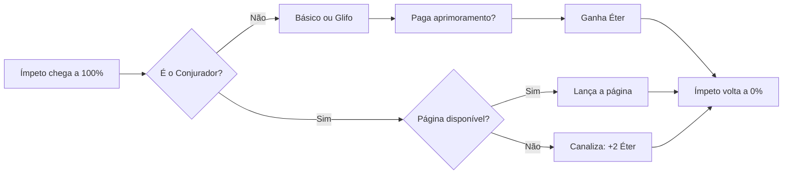

# SIGILOS — Game Design Document

Sep 23, 2026 · @Mikael

## 1. Visão geral

**Sigilos** (título provisório) é um gacha de fantasia para um jogador, offline e sem loja: você coleciona criaturas, grava sigilos nelas e comanda batalhas por turnos em que as magias são montadas símbolo por símbolo.

Em uma frase: a coleção e as runas de Summoners War: Sky Arena, o recurso compartilhado de Epic Seven, o ritmo de um AFK e magias montadas peça por peça como no Tormenta. A arte de personagem é rabiscada por escolha visual; o mundo é fantasia levada a sério.

**Objetivo do projeto.** Um jogo que você mesmo abra todo dia por 5 a 15 minutos, durante meses, pelo prazer de montar combinações e ver o time crescer. Critério de sucesso: jogar a versão 1.0 por 90 dias seguidos sem se obrigar.

| Item | Decisão |
| --- | --- |
| Jogadores | 1, offline, save local |
| Plataforma | PC primeiro; Android depois, com o mesmo código |
| Sessão típica | 5 a 15 min, 1 ou 2 vezes por dia |
| Equipe | 1 pessoa, cerca de 8 a 10 h por semana (premissa a confirmar) |
| Tamanho da 1.0 | 40 invocações (8 famílias em 5 elementos), 3 regiões (60 fases), Torre de 60 andares, 3 Conjuradores |
| Prazo estimado | MVP jogável em cerca de 3 meses; 1.0 em 9 a 12 meses |

**O que o jogo não é.** Sem monetização, servidor, PvP online, stamina, eventos com prazo, cutscenes ou dublagem. Esses sistemas existem para reter pagantes e custam meses; num projeto pessoal só atrapalham.

## 2. Pilares de design

Toda decisão de sistema passa por estes quatro filtros; o que não serve a nenhum deles sai do escopo.

1. **Magia é linguagem.** Habilidades, feitiços e equipamento são feitos dos mesmos símbolos. A profundidade vem de combinar poucas peças, não de acumular sistemas.
2. **Velocidade é tática.** Quem age primeiro e quem é atrasado decide a luta; a barra de Ímpeto é a principal camada de estratégia.
3. **Respeite o tempo.** O progresso acontece com o jogo fechado. Nada pune quem ficou dias sem abrir.
4. **Rabisco é estilo, não tema.** A arte é rápida de propósito para o conteúdo crescer; o mundo continua sendo fantasia épica. Nenhum desenho leva mais de 15 minutos.

## 3. O que pegar de cada referência

De cada jogo entra só o que serve aos pilares; o resto é cortado de propósito para caber no tempo de uma pessoa.

| Referência | O que entra | O que fica de fora |
| --- | --- | --- |
| Summoners War: Sky Arena | Barra de ataque por Velocidade; runas em 6 espaços com conjuntos de 2 e 4 peças; famílias de monstros em 5 elementos; Despertar; duplicatas que sobem habilidades; habilidade de líder; masmorras que soltam conjuntos específicos; masmorras secretas por família; arena contra defesa controlada pela IA | Evolução de estrelas com monstros de sacrifício; runas até +15 com 4 subatributos; guerra de guildas, cerco e PvP em tempo real; cristais e pacotes |
| Epic Seven | Almas compartilhadas que turbinam habilidades (viram o Éter); recargas de habilidade; heróis com nome e personalidade; Abismo como torre de desafio | Equipamento separado das runas; artefatos; cutscenes; Labirinto; PvP em tempo real |
| AFK Arena e AFK Journey | Recompensas ociosas; nível compartilhado entre heróis; batalha automática com time preparado; sessões curtas sem stamina | Dezenas de moedas e menus; eventos com prazo; pacotes pagos |
| Tormenta (RPG) | Escolas de magia viram Glifos; círculos com custo crescente; pagar mana extra por aprimoramentos; o grimório como objeto central | Nomes, deuses, lugares e textos do cenário |

Summoners War e Epic Seven se sobrepõem muito (ordem de turnos, elementos). Onde divergem, Summoners War decide coleção e runas, e Epic Seven decide o recurso compartilhado.

O mundo e os nomes são originais. Assim o jogo pode ser mostrado a amigos sem nenhuma dúvida de propriedade intelectual.

## 4. Mundo e tom

Neste mundo tudo o que existe foi escrito com oito Glifos primordiais, e conjurar é redesenhá-los. Um Conjurador não cria criaturas: grava um sigilo que as prende a ele por contrato. Você é um Conjurador recém-sagrado de uma ordem quase extinta.

**Conflito.** O Silêncio, uma força sem forma, está desfazendo os Glifos. Onde ele passa, a magia falha e as criaturas se tornam Profanadas, selvagens e hostis. Cada região tem um Conjurador rival que acredita que o Silêncio é a paz.

**Regiões.** Cada região muda uma regra de batalha, o que dá variedade sem exigir arte nova.

| Região | Paisagem | Regra de batalha | Chefe |
| --- | --- | --- | --- |
| 1 | Planície dos Menires | Nenhuma; ensina o básico | O Mestre de Correntes, rival especialista em Laço |
| 2 | Arquipélago Afogado | Maré: a cada 3 rodadas, unidades de Água ganham +20% de Ímpeto | A Serpe-Mãe |
| 3 | Cidadela do Selo Partido | Glifos instáveis: páginas do Grimório custam +1 Éter em rodadas ímpares | O Arauto do Silêncio |
| Pós-jogo | Torre dos Círculos | Andares com regras fixas, uma por andar | — |

**Tom.** Fantasia épica clássica, séria no mundo e com leveza nas falas. No máximo três falas por fase: a história é tempero, nunca obstáculo entre o jogador e a luta.

## 5. Direção de arte

A arte de personagem é rabiscada por escolha visual e de produção: é o que permite 40 invocações com uma pessoa só. O mundo, os textos e a interface continuam fantasia, e os sigilos são a única arte feita com capricho.

| Elemento | Regra |
| --- | --- |
| Personagens | Traço solto, no papel (foto ou scan) ou no tablet, no máximo 15 minutos. As criaturas são tratadas com seriedade, não como piada |
| Famílias | Um desenho por família, recolorido nos 5 elementos, como em Summoners War. 8 desenhos cobrem as 40 invocações |
| Despertar | Um segundo desenho por família, mais detalhado e colorido: 16 desenhos de criatura na 1.0 |
| Animação | Linha tremida: 3 versões do mesmo desenho alternando a cerca de 8 quadros por segundo. Movimento só por interpolação (avançar, recuar, tremer), nunca quadro a quadro |
| Inimigos | Criaturas clássicas de RPG, como slime, goblin, lobo, bandido, troll, dragão, etc. Todos seriam as criaturas de 1 ou 2 estrelas da pool de invocações. |
| Sigilos e Glifos | Vetores geométricos limpos, com brilho: 8 Glifos e 3 Formas |
| Raridade | 1, 2, 3, 4 ou 5 estrelas. Mas do 3 pra frente com moldura de bronze, prata ou ouro |
| Interface | Pergaminho discreto, fonte serifada legível nos títulos e fonte limpa nos números |
| Som | Pedra, papel e sussurros de conjuração; música orquestral de biblioteca livre |

**Paleta.** Uma cor forte por elemento (vermelho Fogo, azul Água, verde Vento, dourado Luz, violeta Trevas) sobre fundos neutros de pergaminho e pedra. O elemento se lê antes do desenho.

## 6. O sistema de Símbolos

Toda magia é uma frase de três peças: **Glifo** (o que faz), **Forma** (quantos alvos) e **Círculo** (quanto custa e quão forte é). Aprimoramentos são sufixos opcionais, pagos com Éter na hora de usar.

A leitura de Tormenta usada aqui: magia como sistema de partes (escola, círculo, custo em mana e aprimoramentos), com cada escola representada por um símbolo próprio. Os mesmos 8 símbolos aparecem nas criaturas, nos feitiços e no equipamento.

### Os 8 Glifos

| Glifo | Escola de origem | Efeito base | Extra no Círculo III |
| --- | --- | --- | --- |
| Muralha | Abjuração | Escudo e redução de dano | Anula o próximo ataque recebido por cada aliado |
| Olho | Adivinhação | Empurra o Ímpeto de aliados; revela Ocultos | Próximo ataque do alvo é crítico |
| Porta | Convocação | Invoca um espírito do elemento que age por 2 turnos | O espírito age na hora e dura 3 turnos |
| Laço | Encantamento | Provocação | Atordoa por 1 turno |
| Estilhaço | Evocação | Dano direto | Ignora metade da Defesa |
| Véu | Ilusão | Oculto (não pode ser alvo de ataques únicos) e esquiva | Cria um sósia que absorve 1 ataque |
| Ossada | Necromancia | Drena vida | Revive um aliado com 30% da Vida |
| Espiral | Transmutação | Aumenta ou reduz atributos | Troca dois atributos do alvo entre si |

### Formas e Círculos

| Forma | Alvos | Custo extra |
| --- | --- | --- |
| Único | 1 | +0 Éter |
| Dupla | 2 | +1 Éter |
| Todos | Todos os aliados ou todos os inimigos | +2 Éter |

Círculo I custa 1 Éter, II custa 3 e III custa 6. A curva cresce rápido de propósito: um Círculo III é o momento decisivo da luta, não a rotina.

### Elementos

Toda invocação tem um elemento. Fogo vence Vento, Vento vence Água, Água vence Fogo; Luz e Trevas têm vantagem uma sobre a outra. Vantagem dá +25% de dano; desvantagem, −25%.

### Ressonância

O Grimório só aceita Glifos que existem no seu time. Montar o time é escolher o vocabulário de magia do Conjurador. Duas invocações do mesmo Glifo reduzem em 1 Éter o custo das páginas desse Glifo (mínimo 1).

### Onde os símbolos aparecem

- **Invocações:** cada uma tem um Glifo, que define o estilo das suas habilidades.
- **Grimório:** páginas que você monta com Glifo, Forma e Círculo.
- **Sigilos:** o equipamento, no lugar das runas; cada conjunto é um Glifo (seção 10).
- **Gacha:** você traça Glifos para direcionar o resultado (seção 9).

## 7. Combate

Batalha por turnos sem tabuleiro, como em Summoners War e Epic Seven: 4 invocações contra até 5 inimigos por onda, e cada unidade age quando sua barra de Ímpeto enche. Você vence ao derrotar todas as ondas.

### Montagem do time

Quatro invocações; a primeira é a Líder e aplica sua Liderança ao time, se tiver uma. O Conjurador fica fora de campo, não pode ser atacado e entra na barra de Ímpeto como qualquer unidade. Cada fase tem até 3 ondas, como as masmorras de Summoners War.

### Turno



A barra enche em proporção à Velocidade. Efeitos empurram ou atrasam barras, e a ordem dos turnos no início da luta costuma decidir o resultado: é o ajuste fino de velocidade que os dois jogos têm em comum.

### Éter

Recurso único do time, equivalente às Almas de Epic Seven e ao PM de Tormenta. Começa em 0 e vai até 10.

- **Ganho:** +1 por habilidade básica; +2 por habilidade de Glifo; +2 quando o Conjurador canaliza; +1 por inimigo derrotado.
- **Gasto:** aprimoramentos das habilidades e páginas do Grimório.

A decisão central da luta é gastar agora em aprimoramentos ou guardar para uma página de Círculo III.

### O Conjurador

Tem Velocidade fixa (100 no início, subindo com o nível de conta). No turno dele, lança uma página que possa pagar ou canaliza Éter. A 1.0 tem três Conjuradores; o MVP tem só o primeiro.

| Conjurador | Estilo | Regra própria |
| --- | --- | --- |
| Erudito | Controle | Grimório com 4 páginas em vez de 3; Círculo II custa 1 Éter a menos |
| Ritualista | Explosão | Círculo III custa 5 em vez de 6; Velocidade 20 pontos menor |
| Canalizador | Sustento | Canalizar dá +3 Éter; não pode usar Círculo III |

### Grimório

Três páginas montadas antes da luta, todas disponíveis desde o início. Cada página tem recarga igual ao seu Círculo: 1, 2 ou 3 turnos do Conjurador.

### Vitória e derrota

Você vence ao derrotar todas as ondas. Perde se as 4 invocações caírem ou se 30 rodadas passarem.

### Automático e manual

Toda luta pode ser automática. Você não controla a IA passo a passo; define regras antes da luta:

- **Postura de Éter:** Agressiva (gasta em aprimoramentos de dano), Econômica (guarda para Círculo III) ou Equilibrada.
- **Alvo preferido** de cada invocação: menos Vida, vantagem elemental ou maior ameaça.
- **Ordem do Grimório:** a posição de cada página define a prioridade de uso.

Campanha e Masmorras são desenhadas para o automático; Torre e Provações, para o manual. Lutas já vencidas ganham repetição automática e um botão Resolver, que simula na hora.

## 8. Invocações

A 1.0 tem 40 invocações: 8 famílias em 5 elementos, como em Summoners War. Cada variante tem kit e Glifo próprios e, depois do Despertar, um nome próprio, como os heróis de Epic Seven.

### Anatomia

| Campo | Conteúdo |
| --- | --- |
| Identidade | Família, elemento, Glifo e papel (Frente, Atacante, Suporte ou Controle) |
| Raridade | 1, 2, 3, 4 ou 5 estrelas naturais, definida pela família |
| Atributos | Vida, Ataque, Defesa, Velocidade, Crítico, Dano crítico, Foco (chance de aplicar efeitos), Resistência |
| Básico | Habilidade sempre disponível |
| Glifo | Habilidade forte com recarga de 3 a 5 turnos |
| Assinatura | Passiva; famílias de 4 e 5 estrelas também têm Liderança |
| Despertar | Nome próprio, desenho novo e Assinatura melhorada |

### Famílias

| Família | Estrelas | Conceito |
| --- | --- | --- |
| Diabretes de Selo | 3 | Pequenos demônios presos em sigilos de contenção |
| Menires Despertos | 3 | Golens de pedra rúnica que guardam estradas antigas |
| Harpias do Véu | 3 | Caçadoras que se escondem na névoa |
| Cavaleiros Juramentados | 4 | Armaduras vazias movidas por um voto gravado no peito |
| Serpes | 4 | Dragões menores, de voo baixo e humor pior |
| Oráculos de Vidro | 4 | Videntes cujo corpo virou cristal de tanto olhar o futuro |
| Fênix de Cinza | 5 | Aves que renascem das cinzas de um sigilo queimado |
| Sábios Sem Rosto | 5 | Arquimagos que trocaram o próprio rosto por um Glifo |

### Exemplos (um por Glifo)

| Invocação | Ficha | Básico | Glifo (recarga) | Assinatura |
| --- | --- | --- | --- | --- |
| Menir Desperto de Água | 3★ · Muralha · Frente | Golpe de Pedra: 90% de dano e 30% de chance de reduzir o Ataque do alvo. +1 Éter: chance de 60% | Círculo de Pedra (4): escudo de 20% da Vida do Menir em todos os aliados por 2 turnos. +2 Éter: remove também um efeito negativo | Pedra não se move: imune a atraso de Ímpeto e a atordoamento |
| Diabrete de Selo de Fogo | 3★ · Estilhaço · Atacante | Faísca: 2 golpes de 55%. +1 Éter: cada golpe tem 30% de chance de Queimadura | Selo Rompido (3): 180% num alvo; se ele cair, o Diabrete age de novo. +2 Éter: ignora 30% da Defesa | +15% de Velocidade enquanto for o aliado com menos Vida |
| Harpia do Véu de Vento | 3★ · Véu · Atacante | Rasante: 100% de dano e 25% de chance de Cegueira. +1 Éter: chance de 50% | Penas de Névoa (4): fica Oculta por 1 turno e ganha +30% de Ímpeto. +2 Éter: o aliado com menos Vida também fica Oculto | Ao esquivar, contra-ataca com Rasante |
| Cavaleiro Juramentado de Luz | 4★ · Laço · Frente | Juramento: 100% de dano e 30% de chance de Provocar. +1 Éter: Provocar garantido | Voto de Escudo (4): provoca todos os inimigos por 1 turno e recebe −40% de dano por 2 turnos. +2 Éter: provocação de 2 turnos | Liderança: +20% de Defesa. Ao cair, dá escudo de 15% da Vida a todos os aliados |
| Serpe de Trevas | 4★ · Ossada · Controle | Mordida Vil: 110% de dano, drena 30% como Vida. +1 Éter: −50% de cura no alvo por 2 turnos | Hálito de Túmulo (3): 80% em todos, 50% de chance de Maldição (+25% de dano recebido) por 2 turnos. +2 Éter: chance de 100% | Sempre que um inimigo cai, recupera 15% da Vida e gera 1 Éter |
| Oráculo de Vidro de Água | 4★ · Olho · Suporte | Visão Fria: 90% de dano e atrasa o Ímpeto do alvo em 15%. +1 Éter: atrasa 30% | Profecia (4): todos os aliados ganham +25% de Ímpeto. +2 Éter: e +15% de Velocidade por 2 turnos | Liderança: +15% de Velocidade. Aliados não sofrem críticos na primeira rodada |
| Fênix de Cinza de Fogo | 5★ · Espiral · Atacante | Chama Espiral: 120% de dano e converte um efeito positivo do alvo em Queimadura. +1 Éter: converte dois | Voo Rubro (4): 90% em todos e Queimadura por 1 turno. +3 Éter: dano ×1,5 | Na primeira vez que cai, renasce com 40% da Vida no turno seguinte dela |
| Sábio Sem Rosto de Trevas | 5★ · Porta · Controle | Toque do Limiar: 100% de dano e 30% de chance de atordoar | Abrir a Porta (5): invoca uma cópia de um inimigo, que luta do seu lado por 2 turnos com 50% dos atributos. +3 Éter: 100% dos atributos | Sempre que você lança uma página do Grimório, ganha +20% de Ímpeto |

As melhores Assinaturas nascem do conceito da família: a fênix renasce, o menir não se move. Esse é o molde para as outras 32.

## 9. O gacha: Invocação ritual

Invocar é um ritual: você gasta Pergaminhos, escolhe até 2 Glifos que já conhece e traça o sigilo. As taxas são generosas e a garantia é sempre visível, porque não há ninguém para vender nada.

| Regra | Valor inicial |
| --- | --- |
| Custo | 1 Pergaminho Místico por invocação; 10 por dez |
| Taxas | 3★ 65%, 4★ 28%, 5★ 7% |
| Luz e Trevas | Metade da chance das outras variantes da mesma raridade, como em Summoners War |
| Garantia | 5★ após 60 invocações sem nenhuma, com contador na tela |
| Direcionamento com 1 Glifo | Metade dos resultados vem desse Glifo |
| Direcionamento com 2 Glifos | 30% de cada um; o resto é livre |
| Duplicata além do máximo | Vira Fragmentos: 5 (3★), 10 (4★) ou 20 (5★) |
| Troca por Fragmentos | Qualquer invocação: 30, 60 ou 120 Fragmentos, conforme a raridade |

**O traçado.** Você desenha o Glifo com o mouse ou o dedo, e um reconhecedor de gestos simples (como o $1 Unistroke Recognizer, cerca de 100 linhas de código) avalia o desenho. Não muda as taxas: um traçado limpo só dá 5 de Pó de Sigilo. Invocações de dez usam traçado automático.

**Tiques: surpresa para quem criou o jogo.** Você vai conhecer todas as criaturas, então o gacha precisa de uma surpresa que você não controla. Cada cópia obtida sorteia um Tique entre 12, um traço de personalidade com ganho e custo:

- **Apressado:** +8 de Velocidade, −10% de Vida.
- **Meticuloso:** +15% de Foco, começa a luta com −10% de Ímpeto.
- **Imprudente:** +20% de Crítico, −10% de Defesa.
- **Teimoso:** +20% de Resistência, −8% de Ataque.

Ao receber uma duplicata, você escolhe manter o Tique antigo ou ficar com o novo. Isso dá motivo para invocar criaturas que você já tem e cria versões diferentes da mesma.

**Convidados.** Peça a amigos o desenho de uma criatura e um Glifo num modelo de uma página; você escreve as habilidades. É a outra fonte de surpresa, e a que dá mais vontade de abrir o jogo.

## 10. Progressão

Há quatro eixos de poder: nível compartilhado, Ecos, Despertar e Sigilos. Qualquer sistema novo precisa substituir um deles, não somar.

| Eixo | Como sobe | O que dá |
| --- | --- | --- |
| Nível | Gastando Essência nas 5 invocações de maior nível | Todas as outras ficam no nível da quinta. Testar qualquer time custa zero |
| Ecos | Duplicatas, de 0 a 5 | Cada Eco sobe um nível de habilidade (mais dano ou menos recarga), como em Summoners War; no quinto, +10% de atributos |
| Despertar | Essência e vitória na Provação da família | Nome próprio, desenho novo e Assinatura melhorada |
| Sigilos | Drop de Masmorras, melhorados com Pó de Sigilo | Atributos, conjuntos e o ajuste fino de Velocidade |

**Nível compartilhado.** É o sistema de AFK Arena que mais combina com um elenco grande e um jogador só, e substitui a evolução com monstros de sacrifício. O teto é 20 na região 1, 40 na 2 e 60 na 3.

**Sigilos: as runas de Summoners War, com menos sorteio.** Cada invocação tem 6 espaços dispostos em círculo, o próprio círculo de conjuração. Os espaços 1, 3 e 5 têm atributo principal fixo (Ataque, Defesa e Vida); os espaços 2, 4 e 6 variam. Cada Sigilo tem 3 subatributos e melhora de +0 a +9; em +3, +6 e +9 um subatributo sorteado aumenta.

| Conjunto | Peças | Bônus |
| --- | --- | --- |
| Espiral | 4 | +25% de Velocidade |
| Porta | 4 | 20% de chance de ganhar um turno extra |
| Laço | 4 | 25% de chance de atordoar ao acertar |
| Estilhaço | 4 | +40% de dano crítico |
| Ossada | 4 | Drena 35% do dano causado |
| Muralha | 2 | +15% de Defesa |
| Olho | 2 | +20% de Foco |
| Véu | 2 | +20% de Resistência |

Com 6 espaços cabem um conjunto de 4 e um de 2, ou três de 2. Refazer um subatributo custa Pó de Sigilo e evita que um drop ruim seja perdido.

## 11. Loop ocioso e modos de jogo

Uma sessão típica dura de 5 a 15 minutos: coletar o que acumulou, vencer 1 a 3 lutas, invocar, ajustar o time e fechar.


**Ociosidade.** Com o jogo fechado, seus círculos de invocação continuam canalizando, como as construções da ilha em Summoners War. Acumulam Essência, Pergaminhos, Pó de Sigilo e entradas de Masmorra; a taxa cresce com a fase mais alta vencida, e o acúmulo para em 12 horas. Uma vez por dia, a Canalização Rápida entrega 2 horas de recompensa na hora.

| Modo | Inspiração | Controle | Para que serve | Entra em |
| --- | --- | --- | --- | --- |
| Campanha: 3 regiões de 20 fases | AFK | Automático | Aumenta a ociosidade e o teto de nível | MVP (região 1) |
| Masmorras de Sigilos: Golem Rúnico, Ninho da Serpe, Cripta do Rei Ossudo, Santuário Afogado | Masmorras de Summoners War e Caçadas de Epic Seven | Automático ou Resolver | Cada uma solta 2 conjuntos de Sigilo | v0.5 |
| Torre dos Círculos: 60 andares com regras fixas | Torre de Summoners War e Abismo de Epic Seven | Manual | Pergaminhos, Pó de Sigilo, desafio de montagem | v0.5 |
| Provações: uma luta fixa por família | Despertar de Summoners War | Manual | Libera o Despertar | v0.5 |
| Portais Secretos: surgem ao vencer Masmorras e ficam até você usar | Masmorras secretas de Summoners War | Automático | Três vitórias no mesmo portal dão uma invocação daquela família | v1.0 |
| Arena dos Aprendizes: rivais gerados com poder parecido com o seu | Arenas de Summoners War e Epic Seven | Automático | Fragmentos e rivais recorrentes | v1.0 |
| Espelho: exporta o time como código de texto para um amigo enfrentar | — | Automático | Social sem servidor | Depois da 1.0 |

Entradas de Masmorra chegam pela ociosidade, uma a cada 30 minutos, até 24 guardadas. Não existe energia que se perde por não jogar.

## 12. Economia

Quatro moedas, e nunca mais que isso. Jogando normalmente entram cerca de 4 Pergaminhos Místicos por dia, ou 4 invocações.

| Moeda | De onde vem | Para onde vai |
| --- | --- | --- |
| Pergaminhos Místicos | Ociosidade, primeira vitória de cada fase, Torre, conquistas | Invocar |
| Essência | Ociosidade, fases | Nível compartilhado e Despertar |
| Pó de Sigilo | Ociosidade, Masmorras, Torre, traçado limpo | Melhorar Sigilos e refazer subatributos |
| Fragmentos | Duplicatas excedentes, Arena | Trocar por uma invocação escolhida |

### Ritmo-alvo

| Marco | Quando deve acontecer |
| --- | --- |
| Primeira 5★ | Primeira sessão, garantida no tutorial |
| Primeiro Despertar | Cerca de 2 semanas |
| Região 1 completa | Cerca de 2 semanas |
| As 40 invocações coletadas | Cerca de 8 semanas |
| Primeira 5★ com 5 Ecos | Cerca de 3 meses |
| Torre no andar 60 | Cerca de 4 meses |

Se o jogo ficar chato no teste, a primeira alavanca é dar mais Pergaminhos. Aqui a generosidade não tem custo comercial.

## 13. Escopo, tecnologia e roadmap

Cada fase termina num jogo que você já consegue jogar; se o projeto parar em qualquer ponto, sobra algo jogável. As fases somam de 7 a 9 meses a 8–10 horas por semana; com folga, de 9 a 12.

### Tecnologia

| Peça | Escolha |
| --- | --- |
| Motor | Godot 4: gratuito, bom em 2D, exporta para PC, Android e web |
| Conteúdo | Invocações, páginas e fases em arquivos de dados. Uma variante nova é um arquivo, sem desenho novo |
| Simulação | Combate separado da tela e determinístico (semente fixa). Permite rodar milhares de lutas sem gráficos para balancear |
| Arte da 1.0 | 16 desenhos de criatura (8 famílias e seus Despertares) e 11 ícones de símbolo |
| Save | Arquivo local, sem conta nem servidor |

### Fases

| Fase | Duração | Entrega | Pergunta que responde |
| --- | --- | --- | --- |
| 0. Simulador em texto | 2 semanas | Combate em linha de comando ou planilha: Ímpeto, Éter, 8 invocações | A matemática de velocidade e Éter é interessante? |
| 1. Núcleo de combate | 6 a 8 semanas | Tela de batalha, ondas, Erudito, 8 invocações, 3 páginas prontas, IA automática, 10 fases | O automático é bom de assistir e o manual é bom de jogar? |
| 2. MVP: loop AFK e gacha | 4 a 6 semanas | Ociosidade, nível compartilhado, invocação com garantia, 3 famílias (15 invocações), região 1 | Dá vontade de voltar no dia seguinte? |
| 3. v0.5: profundidade | 8 a 10 semanas | Grimório montável, Sigilos, Masmorras, Provações e Despertar, Torre até 30, traçado, 5 famílias (25) | Existe teorização para semanas? |
| 4. v1.0: conteúdo | 10 a 12 semanas | 8 famílias (40), regiões 2 e 3, Torre 60, Arena, Portais Secretos, 3 Conjuradores, Tiques | Você joga 90 dias seguidos? |
| Depois | Contínuo | Uma família nova (5 invocações) quando der vontade, Convidados, Espelho | — |

A fase 0 é a mais barata e a mais importante: combate por turnos com velocidade é quase só matemática, então dá para testar sem nenhum gráfico.

**Ordem de corte se atrasar:** Arena, depois Portais Secretos, depois o terceiro Conjurador, depois a região 3 vira pós-1.0. Nunca cortar: Éter compartilhado, Sigilos e ociosidade.

## 14. Riscos e perguntas em aberto

O maior risco não é técnico: é o escopo crescer até o projeto parar. Os outros têm mitigação simples.

| Risco | Por que preocupa | Mitigação |
| --- | --- | --- |
| Escopo crescente | É o que mais mata projetos pessoais | Sistema novo substitui um eixo, não soma; toda fase termina jogável |
| Sigilos pesados | Seis espaços com subatributos é o sistema mais caro de balancear e de interface | +9 e 3 subatributos em vez de +15 e 4; conjuntos fixos; subatributo refazível |
| IA gastando Éter mal | Automático burro frustra | Posturas simples, testadas em massa no simulador |
| Combinações do Grimório | 8 Glifos × 3 Formas × 3 Círculos dão 72 páginas possíveis | Efeitos calculados por fórmula, não à mão; simulador para achar combos quebrados |
| Gacha sem tensão | Você conhece todas as criaturas | Tiques, Convidados, garantia visível e o ritual do traçado |

### Perguntas em aberto

- [x] Os símbolos de conjuração foram lidos como escolas, círculos e aprimoramentos. Se você pensou numa parte específica do lore, os Glifos podem ser trocados por ela. Está correto da forma que está
- [x] Famílias em 5 elementos (Summoners War) ou heróis únicos com nome (Epic Seven)? Famílias poupam arte; heróis únicos têm mais personalidade. Familias
- [x] Plataforma principal: PC ou celular? Muda a interface de batalha e do traçado. PC
- [x] Qual motor você já domina? Godot é sugestão, não requisito. Godot
- [ ] Quantas horas por semana há de verdade? O roadmap supõe 8 a 10.
- [x] Quer mostrar para amigos? Se sim, Convidados e Espelho sobem de prioridade. Sim

## 15. Apêndice: fórmulas e números iniciais

São valores de partida para o simulador, feitos para serem mudados no primeiro teste.

### Dano

```latex
D = ATQ \times M \times \frac{100}{100 + DEF} \times E \times C
```

M é o multiplicador da habilidade (por exemplo, 0,8 para 80%). E vale 1,25 com vantagem elemental, 0,75 com desvantagem e 1 no neutro. C vale 1,5 no crítico (mais o bônus de Dano crítico) e 1 fora dele.

### Ímpeto

```latex
t = \frac{100 - I}{VEL}
```

I é o Ímpeto atual em porcentagem; a unidade com o menor t age primeiro. Empurrar o Ímpeto em 20% soma 20 a I, na hora.

### Páginas do Grimório

```latex
\text{Custo} = C + F - R, \quad C \in \{1, 3, 6\}, \; F \in \{0, 1, 2\}, \; R \in \{0, 1\}
```

C é o custo do Círculo, F o da Forma (Único, Dupla, Todos) e R a Ressonância. Custo mínimo de 1.

| Círculo | Potência por alvo | Potência por Éter (Único) | Recarga |
| --- | --- | --- | --- |
| I | 100% | 100% | 1 turno |
| II | 200% | 67% | 2 turnos |
| III | 350% e o efeito extra do Glifo | 58% | 3 turnos |

Formas com mais alvos reduzem a potência por alvo: Dupla 75%, Todos 55%. Círculos altos rendem menos por Éter de propósito; o que compram é explosão de poder e o efeito extra.

### Atributos de base no nível 60 (5★)

| Papel | Vida | Ataque | Defesa | Velocidade |
| --- | --- | --- | --- | --- |
| Frente | 6000 | 500 | 400 | 95 |
| Atacante | 4000 | 900 | 200 | 110 |
| Suporte | 4200 | 550 | 250 | 115 |
| Controle | 4500 | 650 | 250 | 105 |

Invocações de 4★ usam 92% desses valores e as de 3★, 85%. Velocidade é fixa desde o nível 1; os outros atributos começam em 25% e crescem em linha reta até o 60. Velocidade só muda por Sigilos, Tiques e Liderança, para o ajuste fino continuar importando.

O Conjurador não tem Vida: só Velocidade (100 no início) e Poder, que escala as páginas com o nível de conta.
