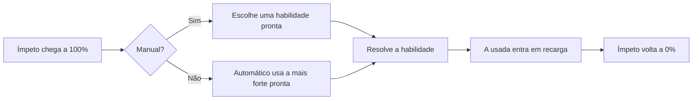
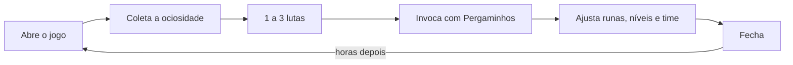

# SIGILOS — Game Design Document

Sep 23, 2026 · @Mikael

> **Revisão de 24/09/2026, depois dos primeiros testes do MVP.** O Erudito e todo o Grimório (páginas, Formas, Círculos, Ressonância) saíram do jogo. A base mecânica e visual passa a ser Summoners War: nível de 1 a 40 por invocação, Despertar com nome próprio e estrelas roxas, runas de 6 espaços. O Éter ficou escasso (só Glifo e inimigo derrubado geram) e é exclusivo do modo manual: o automático nunca o gasta. O jogo ganhou a tela de Monstros e o Compêndio, que explica Glifos, elementos, efeitos, runas e regras.

> **Segunda revisão de 24/09/2026: runas e atributos iguais aos de Summoners War.** Runas e atributos das invocações são a parte mais importante do jogo, então seguem Summoners War em tudo: runas de 1 a 6 estrelas, raridade pelo número de subatributos, melhora até +15 com 4 subatributos, atributo inato, as tabelas de números de lá, custo para tirar runa, Pedra de Afiar e Gema Encantada, e os 16 conjuntos (dois por Glifo). A única diferença: **a melhora de runa nunca falha**; em troca, cada nível custa o preço médio de Summoners War contando as falhas, e o Pó de Sigilo ficou escasso. Os atributos passaram para a escala de lá (uma 5★ no nível 40 tem cerca de 9 mil de Vida), com Crítico 15%, Dano crítico 50%, Resistência 15% e Precisão 0% de base, a curva de Defesa de lá, a Liderança sobre a base e o Despertar com os bônus de lá.

> **Terceira revisão de 24/09/2026.** Os Glifos deixaram de ser coisa das invocações: agora são os 16 símbolos de runa, um por conjunto, e cada um quer dizer a mesma coisa em todo o jogo (Gebo, ×, é atordoar; Algiz, ᛉ, é Defesa). A segunda habilidade virou "Especial". Cada invocação é uma cópia nova (nível 1, sem Despertar), com coleção de 50 vagas e um Baú sem limite; cópias repetidas são fundidas em Ecos ou liberadas em Fragmentos. Lutas são de até 5 contra 5, com uma equipe por conteúdo. As Masmorras entraram: quatro de runas (4 a 6 estrelas, quatro conjuntos cada) e a Forja (Pedras de Afiar e Gemas), que a Campanha deixou de soltar. O Compêndio foi refeito, o Grimório mostra tudo o que existe, e todo texto da interface mora em Data/texts.

> **Quarta revisão de 25/09/2026: Mana, Ouro e Loja.** Farmar runas é o centro do jogo. As entradas de Masmorra viraram **Mana**: toda vitória, na Campanha ou numa Masmorra, custa Mana (a derrota não custa nada), e a canalização recarrega até o máximo (60 no nível 1 da conta, 120 no nível 60). A conta ganhou nível, de 1 a 60, com a experiência de toda vitória. O Pó de Sigilo saiu: a **Essência** paga nível, Despertar e melhora de runa, e cada runa melhorada disputa com os monstros. Entrou o **Ouro**, a moeda rara de gacha comum (canalização, nível da conta, primeira vitória em andar de Masmorra), que a **Loja** troca por Mana ou Pergaminhos; a canalização deixou de dar Pergaminhos. O Violento dá no máximo um turno extra por turno do monstro. Monstros no Baú guardam as runas deles, fora das 800 vagas do inventário de runas.

> **Quinta revisão de 25/09/2026: o jogo passa a ser em inglês.** Ids, nomes de dados (invocações, inimigos, fases, Masmorras, Loja) e todo texto da interface nascem em inglês (Data/texts/en.json); o português vira uma tradução da interface (Data/texts/pt-BR.json). Este documento segue em português, e os nomes daqui são os de design: os do jogo estão em Data/ (Baú é Vault, Ímpeto é Impetus, Éter é Aether, Glifo é Glyph). (Desde a décima quarta revisão, a base voltou a ser o português; só os ids seguem em inglês.)

> **Sexta revisão de 25/09/2026: inimigos são invocações.** Limo, Goblin, Lobo e Bandido viraram famílias de invocação 3★, o Troll 4★ e o Dragão 5★, cada uma com 5 elementos e Assinatura própria (Corpo Gelatinoso reduz dano; Golpe Baixo bate mais em quem tem efeito negativo; Instinto de Caça bate mais em quem está abaixo da metade da Vida; Emboscada começa cada onda com Ímpeto; Regeneração cura no começo do turno; Fogo de Dragão queima quem acerta). Os inimigos comuns de fases e Masmorras são essas invocações com Vida e Ataque reforçados pela raridade e pela dificuldade do encontro; só os chefes continuam como criaturas únicas. O Grimório agrupa as invocações por família, com os elementos no detalhe. Entrou a **Batalha automática**: até 30 lutas seguidas, como o Resolver, mas cada luta leva o tempo que levaria no automático em 2×. A tela de batalha ficou com duas velocidades, 1× e 2× (o 2× corre três vezes mais rápido). O Éter passou a aprimorar só a habilidade especial: o básico não tem versão aprimorada.

> **Sétima revisão de 26/09/2026: habilidades, estrelas e experiência de Summoners War.** Sem PvP, o Éter não era estratégia: saiu do jogo. A antiga versão aprimorada virou o que o Despertar libera, e o que o Despertar dá segue as estrelas naturais, como lá: as 3★ ganham uma habilidade nova (uma Passiva ou uma ativa), as 4★ uma habilidade mais forte (e algumas uma terceira ativa), as 5★ quase não mudam (só o atributo). O Despertar custa 25 000 de Essência nas 3★, 50 000 nas 4★ e 75 000 nas 5★. A Assinatura virou **Passiva**, e nem todo monstro tem uma: alguns têm uma terceira habilidade ativa no lugar. Os Ecos saíram: cada habilidade tem níveis (mais dano, mais cura, mais chance de efeito ou menos recarga), e fundir uma cópia sobe o nível de uma habilidade sorteada. Toda invocação nasce nas estrelas naturais e **evolui** até 6★ com Essência e Fragmentos quando chega ao nível máximo da estrela (10 + 5 por estrela: 25 no 3★, 40 no 6★), voltando ao nível 1, como lá (desde a décima primeira revisão, o nível fica). A experiência de cada nível é a tabela de Summoners War por estrela, e a experiência de fases e Masmorras segue a escala de lá (de 110 na fase 1 a 2400 no andar 5), com a Essência valendo 10 de experiência. Fases e andares têm estrelas e nível: a Campanha vai de 3★ nível 1 a 5★ nível 30, e as Masmorras de 4★ nível 25 a 6★ nível 35.

> **Oitava revisão de 26/09/2026: interface de símbolos, a partir de um croqui.** A interface virou fantasia medieval aconchegante de runas e sigilos: couro envelhecido nos painéis, pedra entalhada nos fundos, ouro fosco nas molduras e o brilho das runas (azul arcano sob o mouse e no que está ligado, verde espiritual no que pede atenção). Nada de cara de página web: a rolagem é uma gema sem trilho, as caixas de marcar são sigilos que acendem, as listas suspensas viraram carrosséis de sigilos em arco e as barras são de energia entalhada. Os botões são símbolos, sem texto (o nome aparece ao passar o mouse), e texto explicativo só existe no Compêndio. O Santuário segue o croqui: retrato da conta com o nível no canto, recursos no alto, uma constelação de atalhos personalizável no centro (o sigilo do meio é a canalização), a engrenagem da Configuração embaixo à esquerda e Loja, Mapa e Bolsa embaixo à direita. O Mapa tem três portais (Torre e Provações ainda fechados, Campanha, Masmorras); a Bolsa é um círculo de conjuração com monstros, runas, equipes, os dois livros e o portal de invocar no centro; a ficha de Monstros ganhou abas em pé (Atributos, Runas, Habilidades, Despertar). (A décima terceira revisão trocou os botões de símbolo por botões com texto, as dicas por janelas, e a Bolsa e a constelação por uma tela inicial com barra de navegação.)

> **Nona revisão de 27/09/2026: fontes, runas e menos botões.** A fonte do jogo é a SFC Wezards, e os Glifos passaram a ser escritos na fonte rúnica Kehdrai (nítidos em qualquer tamanho). A runa em miniatura é uma pedra quadrada de cantos redondos, com o espaço e as estrelas no alto e a melhora embaixo. O Resolver saiu: a Batalha automática pergunta quantas lutas seguidas (30 de início, até 100). A Canalização Rápida saiu. Os efeitos de batalha têm símbolos próprios, e toda arte é PNG renderizado do SVG, recortado no formato do componente.

> **Décima revisão de 27/09/2026: o campo de batalha.** A luta acontece num círculo de conjuração oval: os aliados no arco de baixo à esquerda, os inimigos no de cima à direita, e quem ataca corre até o alvo, golpeia e volta, como em Summoners War; cada alvo atingido espirra, todos de uma vez num golpe em área. A ordem de turno fica em pé à esquerda, as habilidades embaixo à direita, e a pausa no canto de cima oferece continuar, recomeçar a luta e sair. Na ficha da runa, o que ela ganhou desde que a tela abriu aparece em verde ao lado do valor.

> **Décima primeira revisão de 30/09/2026: atributos por orçamento.** Os atributos das invocações deixaram de sair de uma tabela por papel: todo monstro das mesmas estrelas naturais gasta o mesmo orçamento de BVP (pontos de valor de base: Vida ÷ 15 + Ataque + Defesa + Velocidade × 3), e o papel (Vida, Ataque, Defesa ou Suporte) decide onde. Elemento, família e variante só deslocam a distribuição; o Despertar tem o orçamento dele. Cada família virou um arquivo só, com as variantes e os atributos já calculados, feito no construtor de famílias. Entraram três efeitos: Veneno (acumula), Bomba (explode depois da contagem, ignorando a Defesa) e Quebra de Defesa. Evoluir deixou de voltar ao nível 1: o monstro mantém o nível e os atributos sobem na hora.

> **Décima segunda revisão de 30/09/2026: oito famílias novas e as primeiras 2★.** Entraram oito famílias, cada uma com 5 elementos e a Passiva dela. Nas 5★: Magos (Fluxo Arcano: chance de encurtar as próprias recargas no começo do turno), Paladinos (Devoção: curam o aliado mais ferido no começo do turno) e Druidas (Couro de Espinhos: quem bate neles recebe de volta parte do dano). Nas 4★: Gárgulas (Olhar de Pedra: chance de atordoar quem bate nelas), Vampiros (Sede de Sangue: drenam parte de todo dano que causam) e Corvos (Mau Agouro: chance de Maldição em quem eles acertam). E as primeiras 2★: Pássaros (Voo Esquivo: chance de esquivar de cada golpe) e Pixies (Pó de Pixie: chance de tirar um efeito negativo de um aliado no começo do turno). O jogo passa a ter 17 famílias e 85 invocações. As 2★ seguem a regra das 3★ (habilidade nova no Despertar, sem Liderança), com o menor orçamento de atributos, e nascem no 2★ nível 1. O Pergaminho Místico continua sorteando de 3★ a 5★: de onde vêm as 2★ é pergunta em aberto (seção 14).

> **Décima terceira revisão de 30/09/2026: interface para celular.** A interface foi refeita para o toque, e a ordem de prioridade é clareza, uso no celular, hierarquia, consistência, acessibilidade e só então estética; ela tem de se explicar sozinha, sem dica e sem saber antes. Nada depende do mouse: as dicas saíram, e toda explicação abre numa **janela contextual** colada no elemento tocado (elemento → toque → janela), fechada pelo ✕, por um toque fora ou pelo Voltar. Todo botão de ação tem texto (o símbolo pode acompanhar); só as ações universais ficam em símbolo, o ✕ de fechar e a seta de voltar. Os botões são de três pesos, iguais no jogo todo: principal (laranja, a ação da tela), comum e perigoso (vermelho, vender e liberar). **Segurar um monstro**, em qualquer lugar em que ele apareça (coleção, equipes, fases, campo de batalha, ordem de turno, resultado), abre o resumo dele: retrato, estrelas, elemento, nível, atributos, efeitos, habilidades e onde ele está; segurar uma runa abre a ficha dela. A **Batalha automática** corre por trás: fechar a janela dela não para nada, e um selo no alto, no meio da tela, mostra "4/30" e a barra da luta atual em qualquer tela; tocar nele reabre a janela, com o progresso, as lutas que faltam (dá para mudar), o que ela rendeu e as runas ganhas, que dá para vender e melhorar ali mesmo, ou gerenciar na tela de Runas sem parar a batalha. Só o botão Parar, com confirmação, interrompe. A navegação ficou em três níveis: a tela inicial (a conta, a canalização com o que acumulou e o botão Coletar, os caminhos grandes Batalha e Invocação, e a barra de baixo com Monstros, Runas, Equipes, Loja, Grimório, Compêndio e Ajustes), a tela Batalha (Campanha, Masmorras e a Torre, fechada) e cada tela, sempre com a seta de voltar no canto de cima à esquerda. Saíram a Bolsa, a constelação de atalhos e os carrosséis de sigilos; as listas de escolha abrem em janela, e as abas são escritas.

> **Décima quarta revisão de 30/09/2026: o português volta a ser a base.** Todo texto da interface e todo nome dos dados (invocações, Despertares, habilidades, fases, Masmorras, chefes, Loja) nascem em português, e o inglês vira a tradução, nomes inclusive; os ids seguem em inglês. Os nomes voltam aos de antes da quinta revisão onde já existiam (Cavaleiros Juramentados, Diabretes de Selo, Fênix, as fases e as Masmorras), e as variantes se chamam pela família e pelo elemento ("Dragão de Fogo"). O Grimório mostra a família no singular ("Dragão"). A constelação voltou e ocupa o painel da Canalização: o sigilo do centro com o anel do tempo acumulado, sete orbes de pedra em volta (só desenho, cada um com uma estrela que pisca) ligados a ele por fios de luz, e o anel do fundo girando atrás; logo embaixo do centro, o tempo acumulado, o que se juntou e o botão Coletar (tocar no centro também coleta; tocar no tempo explica a Canalização). A versão do jogo aparece no canto de baixo à esquerda do Santuário, para saber de que release é o que está rodando. Gastos grandes de uma vez perguntam antes: subir um monstro até o nível máximo e melhorar uma runa até o próximo marco mostram quanto de Essência sai e aonde chega. As grades de runas e de monstros enchem a largura da tela. Batalha e Campanha deixaram de ser botões laranja: o laranja fica para a ação da tela (Lutar, Coletar, Invocar). O monstro que cai na Campanha diz se é novo, cópia ou se foi ao Baú. Monstros e runas ganharam o botão Bloquear (na ficha, na vitória e na janela da Batalha automática, para o que caiu nela): o cadeado aparece no cartão e na runa, a runa bloqueada não se vende (nem em lote, nem na Batalha automática) e o monstro bloqueado não se libera nem vira material de fusão (ainda recebe fusão, sobe de nível e evolui); desbloquear devolve tudo.

> **Décima quinta revisão de 01/10/2026: conta e save em nuvem.** O jogo ganhou conta (e-mail, senha, convite e um nome único, sem espaço, que aparece no Santuário ao lado do nível), num servidor próprio. A conta leva o progresso entre aparelhos, mas fica aberta em um aparelho por vez: entrar num segundo pergunta antes e derruba o primeiro, que volta para a tela de login. O save do aparelho continua sendo o que vale, e a nuvem é a cópia, enviada a cada minuto, ao pausar e ao sair. Quando o aparelho e a nuvem mudaram os dois, o jogador escolhe qual fica, vendo os dois resumos, e o outro vira backup no aparelho. Jogar sem conta continua existindo, todo local; ao criar a conta, esse progresso sobe para ela. A primeira entrada num aparelho pede internet; depois, a conta lembrada abre sem ela, com o progresso do aparelho, e sincroniza quando a conexão voltar (perguntando qual fica, se a conta também mudou em outro aparelho nesse meio tempo). No Windows, o jogo avisa ao abrir quando sai uma versão nova e se atualiza sozinho (baixa, fecha e abre de novo); abaixo da versão mínima, é atualizar ou sair.

> **Décima sexta revisão de 01/10/2026: a Campanha até a fase 50, o jogo aos poucos e a luta de treino.** Primeiro, a interface. A Fusão ganhou janela própria: só cópias da mesma família, de qualquer elemento (as do mesmo elemento se marcam com um toque), a lista do que vai sumir e a confirmação; a seleção de vários na tela de Monstros ficou só para liberar. Monstros podem ser favoritados (o coração no cartão) e vêm primeiro nas listas. A Loja vende a Gema de Reavaliação, que devolve uma runa ao estado em que caiu, sem melhoras, Pedras de Afiar nem encantamento, listando antes tudo o que desfaz (a Essência gasta não volta). O Despertar deixou de ter um segundo desenho: o monstro desperto é o mesmo desenho, com a borda acesa por dentro na cor do elemento e um anel animado próprio de cada elemento. Toda ação que muda a conta sobe para a nuvem dois segundos depois (várias seguidas viram um envio só), e a invocação sobe antes de o resultado aparecer. As invocações 4★ e 5★ aparecem com halo de raios (Luz e Trevas na cor delas), a derrota diz o que fazer para ficar mais forte, e o quadro de efeitos da luta ganhou o "?". Depois, o balanceamento: os multiplicadores de Dano, Cura e Escudo das habilidades de todas as invocações caíram 30% (arredondados para baixo), e todo inimigo da Campanha e das Masmorras ganhou 30% de Vida, Ataque e Defesa (a Velocidade ficou). Os inimigos passam do 6★ nível 40, até o nível 60, pela mesma reta do 6★; o jogador segue parando no 40. A Campanha vai até a fase 50, em três regiões (a Planície dos Menires, o Arquipélago Afogado e a Cidadela do Selo Partido), com estrelas e nível que só sobem e um multiplicador de força por fase, calibrado no simulador: a fase 50 se vence com nível 20 e runas, ou com 6★ nível 40 sem runas, mas não com nível 20 sem runas. As Masmorras viraram o passo seguinte, cada uma de um elemento e em ordem de dificuldade: Golem (Vento), Serpe (Fogo), Cripta (Trevas), Afogado (Água) e Forja (Luz). O jogo aparece aos poucos: uma conta nova começa por uma luta de treino com um Mestre que ensina enquanto o jogador luta, e o Santuário mostra cada parte quando a Campanha a abre. Por fim, a Batalha automática mostra quanto a luta de agora leva e estima o resto pelas lutas recentes, e melhorar uma runa por ela reabre a ficha com o que subiu em verde.

> **Décima sétima revisão de 05/10/2026: dezenove famílias novas.** Entraram 19 famílias, cada uma com 5 elementos: nas 5★, Unicórnios, Princesas, Anjos e Monges; nas 4★, Piratas, Dríades, Gorilas, Mineradores Anões, Múmias, Liches e Samurais; nas 3★, Arqueiros, Minotauros, Medusas, Esqueletos e Assassinos; nas 2★, Cogumelos, Lagartos e Plantas Carnívoras. Os kits usam o leque inteiro de efeitos (Sono, Silêncio, Karma, Ferida, Bênção, Contragolpe, Reviver, Resistir Crítico, encurtar os efeitos positivos do alvo, ataque em conjunto e turno extra ao derrubar). O Minerador Anão de Fogo é a peça do Golem: encurta os efeitos positivos do alvo antes de bater (a Imunidade, a Defesa+ e o escudo dos Bastiões), ignora parte da Defesa, quebra a Defesa e corta a cura do núcleo; com ele, a equipe preparada fecha o Golem 5 em todas as lutas. O jogo passa a ter 36 famílias e 180 invocações.

> **Décima oitava revisão de 05/10/2026: a Exploração Estelar.** A Torre dos Círculos virou a **Exploração Estelar**, o modo de onde vêm os recursos: um percurso pelas 88 constelações do céu, das Boreais (1 a 21, de Ursa Menor a Andrômeda) às Equatoriais (22 a 51, com as 12 do zodíaco, de Peixes a Pégaso) e às Austrais (52 a 88, do Peixe Austral ao Cruzeiro do Sul). Cada constelação é um andar com a sua mecânica, a **Influência**: regras que valem a luta inteira (Passivas do mesmo tipo das invocações, que o Esquecimento não cala) nos inimigos, só no guardião, no time do jogador ou em todos. Muitas vezes o desafio são as habilidades de uma invocação: o **guardião** da constelação é ela, desperta, com todas as habilidades no máximo e a Vida de chefe; doze chefes novos guardam o que nenhuma família representa (os bichos do zodíaco, os ursos, o caçador, a hidra). O percurso recomeça no dia 1 de cada mês, e cada mês uma de três Explorações (Aurora, Zênite e Crepúsculo, em rodízio) troca os desafios; a recompensa de cada constelação é sempre a mesma e volta todo mês. A luta não custa Mana, tem equipe própria e é feita para o manual. O mapa de cada faixa é o céu de verdade, com os orbes e os fios de luz da constelação da Canalização.


> **Décima nona revisão de 07/10/2026: o grimório do invocador.** A interface inteira passou a ser o gabinete de um invocador que estuda constelações: encadernação de couro, páginas de pergaminho, tinta, sigilos, cartas do céu, selos de cera, metal envelhecido e ouro só no que é precioso. A paleta ficou sóbria: violeta para o místico, índigo para o céu, ouro para o destaque, pergaminho e couro, com pontos de luz celestes. Tudo sai de um sistema só (cores, painéis, separadores, barras, abas, sigilos), e a Exploração Estelar é a referência: o fundo é um céu noturno com nebulosa e astrolábio, a Canalização tem por baixo a carta do céu (órbitas, doze casas e as marcas do grau), o mapa da Exploração a grade de ascensão reta e declinação, e os sigilos redondos grandes a moldura graduada. Tocar na conta, no Santuário, abre o **Grimório do Invocador**, o livro pessoal da conta (seção 12).

## 1. Visão geral

**Sigilos** (título provisório) é um gacha de fantasia para um jogador, offline e sem dinheiro de verdade (a Loja só troca Ouro ganho jogando): você coleciona criaturas, grava sigilos nelas e comanda batalhas por turnos em que as magias são montadas símbolo por símbolo.

Em uma frase: Summoners War: Sky Arena como base mecânica e visual (coleção, nível, Despertar, runas, barra de ataque), o recurso compartilhado de Epic Seven e o ritmo de um AFK. A arte de personagem é rabiscada por escolha visual; o mundo é fantasia levada a sério.

**Objetivo do projeto.** Um jogo que você mesmo abra todo dia por 5 a 15 minutos, durante meses, pelo prazer de montar combinações e ver o time crescer. Critério de sucesso: jogar a versão 1.0 por 90 dias seguidos sem se obrigar.

| Item | Decisão |
| --- | --- |
| Jogadores | 1, offline, save local |
| Plataforma | PC primeiro; Android depois, com o mesmo código |
| Sessão típica | 5 a 15 min, 1 ou 2 vezes por dia |
| Equipe | 1 pessoa, cerca de 8 a 10 h por semana (premissa a confirmar) |
| Tamanho da 1.0 | 40 invocações (8 famílias em 5 elementos), 3 regiões (60 fases), Exploração Estelar de 88 constelações |
| Prazo estimado | MVP jogável em cerca de 3 meses; 1.0 em 9 a 12 meses |

**O que o jogo não é.** Sem monetização, servidor, PvP online, stamina, eventos com prazo, cutscenes ou dublagem. Esses sistemas existem para reter pagantes e custam meses; num projeto pessoal só atrapalham.

## 2. Pilares de design

Toda decisão de sistema passa por estes quatro filtros; o que não serve a nenhum deles sai do escopo.

1. **Magia é linguagem.** Os 16 Glifos são o vocabulário: cada símbolo quer dizer a mesma coisa nas runas, nos efeitos e nos textos. A profundidade vem de combinar poucas peças, não de acumular sistemas.
2. **Velocidade é tática.** Quem age primeiro e quem é atrasado decide a luta; a barra de Ímpeto é a principal camada de estratégia.
3. **Respeite o tempo.** O progresso acontece com o jogo fechado. Nada pune quem ficou dias sem abrir.
4. **Rabisco é estilo, não tema.** A arte é rápida de propósito para o conteúdo crescer; o mundo continua sendo fantasia épica. Nenhum desenho leva mais de 15 minutos.

## 3. O que pegar de cada referência

De cada jogo entra só o que serve aos pilares; o resto é cortado de propósito para caber no tempo de uma pessoa.

| Referência | O que entra | O que fica de fora |
| --- | --- | --- |
| Summoners War: Sky Arena (base mecânica e visual) | Barra de ataque por Velocidade; nível de 1 a 40 por monstro; painéis escuros com moldura dourada; runas em 6 espaços com conjuntos de 2 e 4 peças; famílias de monstros em 5 elementos; Despertar; duplicatas que sobem habilidades; habilidade de líder; masmorras que soltam conjuntos específicos; masmorras secretas por família; arena contra defesa controlada pela IA | Evolução de estrelas com monstros de sacrifício; chance de falha na melhora de runa; conjuntos de runa da Fenda; guerra de guildas, cerco e PvP em tempo real; cristais e pacotes |
| Epic Seven | Almas compartilhadas que turbinam habilidades (viram o Éter); recargas de habilidade; heróis com nome e personalidade; Abismo como torre de desafio | Equipamento separado das runas; artefatos; cutscenes; Labirinto; PvP em tempo real |
| AFK Arena e AFK Journey | Recompensas ociosas; nível compartilhado entre heróis; batalha automática com time preparado; sessões curtas sem stamina | Dezenas de moedas e menus; eventos com prazo; pacotes pagos |
| Tormenta (RPG) | Pagar mana extra por aprimoramentos | Nomes, deuses, lugares e textos do cenário; grimório e círculos de custo (saíram na revisão de 24/09) |

Summoners War e Epic Seven se sobrepõem muito (ordem de turnos, elementos). Summoners War é a base; de Epic Seven fica o recurso compartilhado (Éter).

O mundo e os nomes são originais. Assim o jogo pode ser mostrado a amigos sem nenhuma dúvida de propriedade intelectual.

## 4. Mundo e tom

Neste mundo tudo o que existe foi escrito com dezesseis Glifos primordiais, e conjurar é redesenhá-los. Um Conjurador não cria criaturas: grava um sigilo que as prende a ele por contrato. Você é um Conjurador recém-sagrado de uma ordem quase extinta.

**Conflito.** O Silêncio, uma força sem forma, está desfazendo os Glifos. Onde ele passa, a magia falha e as criaturas se tornam Profanadas, selvagens e hostis. Cada região tem um Conjurador rival que acredita que o Silêncio é a paz.

**Regiões.** Cada região muda uma regra de batalha, o que dá variedade sem exigir arte nova.

| Região | Paisagem | Regra de batalha | Chefe |
| --- | --- | --- | --- |
| 1 | Planície dos Menires | Nenhuma; ensina o básico | O Mestre de Correntes, rival especialista em Laço |
| 2 | Arquipélago Afogado | Maré: a cada 3 rodadas, unidades de Água ganham +20% de Ímpeto | A Serpe-Mãe |
| 3 | Cidadela do Selo Partido | Glifos instáveis: as habilidades começam a luta em recarga | O Arauto do Silêncio |
| Pós-jogo | Exploração Estelar | 88 constelações, cada uma com a sua Influência | Os guardiões das constelações |

A Campanha tem 50 fases: 1 a 20 na Planície dos Menires, 21 a 40 no Arquipélago Afogado (quase todo de Água, para ensinar os elementos e os efeitos; no fim, a Serpe-Mãe) e 41 a 50 na Cidadela do Selo Partido (Luz e Trevas; no fim, o Arauto do Silêncio). O mapa da Campanha tem uma aba por região, e uma região fechada diz em que fase abre. As regras de batalha de cada região ainda não entraram no jogo.

**Tom.** Fantasia épica clássica, séria no mundo e com leveza nas falas. No máximo três falas por fase: a história é tempero, nunca obstáculo entre o jogador e a luta.

## 5. Direção de arte

A arte de personagem é rabiscada por escolha visual e de produção: é o que permite 40 invocações com uma pessoa só. O mundo, os textos e a interface continuam fantasia, e os sigilos são a única arte feita com capricho.

| Elemento | Regra |
| --- | --- |
| Personagens | Traço solto, no papel (foto ou scan) ou no tablet, no máximo 15 minutos. As criaturas são tratadas com seriedade, não como piada |
| Famílias | Um desenho por família, recolorido nos 5 elementos, como em Summoners War. 8 desenhos cobrem as 40 invocações |
| Despertar | O mesmo desenho, com a borda acesa por dentro na cor do elemento e um anel animado próprio de cada elemento (um shader, sem desenho novo) |
| Animação | Linha tremida: 3 versões do mesmo desenho alternando a cerca de 8 quadros por segundo. Movimento só por interpolação (avançar, recuar, tremer), nunca quadro a quadro |
| Inimigos | Criaturas clássicas de RPG, como slime, goblin, lobo, bandido, troll, dragão, etc. Todos seriam as criaturas de 1 ou 2 estrelas da pool de invocações. |
| Glifos e runas | Os 16 Glifos são símbolos de runa (futhark antigo, domínio público), um por conjunto; aparecem dourados nos textos ao lado do termo que querem dizer |
| Raridade | 1, 2, 3, 4 ou 5 estrelas. Mas do 3 pra frente com moldura de bronze, prata ou ouro. Estrelas douradas; roxas depois do Despertar |
| Interface | Base de Summoners War, como o grimório de um invocador que estuda constelações: couro e pergaminho, tinta, sigilos e cartas do céu, com ouro só no que é precioso, a fonte SFC Wezards em tudo e os Glifos na fonte rúnica Kehdrai. Feita para o toque: elementos grandes, botões com texto (símbolo só no ✕ e na seta de voltar), nada que dependa do mouse, e toda explicação numa janela colada no que foi tocado. Segurar um monstro abre o resumo dele; segurar uma runa, a ficha. O brilho arcano marca o que está ligado, o verde espiritual o que pede atenção |
| Som | Pedra, papel e sussurros de conjuração; música orquestral de biblioteca livre |

**Paleta.** Uma cor forte por elemento (vermelho Fogo, azul Água, verde Vento, dourado Luz, violeta Trevas) sobre fundos neutros de pergaminho e pedra. O elemento se lê antes do desenho. A interface é sóbria: o violeta é o místico, o índigo o céu (as cartas e grades), o ouro o destaque e o que é precioso, o couro as encadernações e o pergaminho as páginas escritas a tinta.

## 6. Glifos e elementos

Os Glifos são símbolos de runa (o futhark antigo) e o vocabulário do mundo. Cada um é o símbolo de um conjunto de runas e quer dizer a mesma coisa em todo lugar: na runa, no efeito de combate, na ficha de atributos e nos textos, onde aparece dourado ao lado do termo. Onde houver Gebo (×), é atordoar; onde houver Algiz (ᛉ), é Defesa.

O Compêndio, dentro do jogo, explica cada Glifo, elemento, efeito, runa e regra de combate com os números atuais; o Grimório mostra tudo o que existe.

### Os 16 Glifos

| Glifo | Quer dizer | Conjunto de runas |
| --- | --- | --- |
| Uruz | Vida | Energia |
| Raido | Velocidade | Rapidez |
| Algiz | Defesa | Guarda |
| Othalan | Escudo | Escudo |
| Kauna | Precisão | Foco |
| Pertho | Crítico | Lâmina |
| Jeran | Turno extra | Violência |
| Thurisaz | Contra-ataque | Vingança |
| Gebo | Atordoar | Desespero |
| Dagaz | Imunidade | Vontade |
| Sowilo | Dano crítico | Fúria |
| Tiwaz | Ataque | Fatal |
| Iwaz | Resistência | Perseverança |
| Naudiz | Ímpeto | Nêmesis |
| Laukaz | Dreno | Vampiro |
| Haglaz | Destruição | Destruição |

### Elementos

Toda invocação tem um elemento. Fogo vence Vento, Vento vence Água, Água vence Fogo; Luz e Trevas têm vantagem uma sobre a outra. Vantagem dá +25% de dano; desvantagem, −25%.

## 7. Combate

Batalha por turnos sem tabuleiro, como em Summoners War: até 5 monstros contra até 5 inimigos por onda, e cada unidade age quando sua barra de Ímpeto enche. Você vence ao derrotar todas as ondas.

### Montagem do time

Uma equipe de até 5 monstros por conteúdo: a Campanha, cada Masmorra e a Exploração Estelar guardam a última usada nelas. Não há equipes prontas: o Lutar abre a preparação da luta, com a equipe em formação (três na frente, duas atrás) no alto à esquerda, a última onda (o chefe sozinho na frente) e o botão Lutar com a Mana no alto à direita, e a coleção numa lista que rola de lado embaixo, com Filtros e Ordem, para trocar à vontade. A primeira é a Líder e aplica sua Liderança ao time, se tiver uma. Cada fase tem até 3 ondas, como as masmorras de Summoners War. Na luta, o botão Efeitos mostra o que está sobre cada aliado e inimigo.

O campo é um círculo de conjuração oval visto de cima: os aliados no arco de baixo à esquerda, os inimigos no de cima à direita, frente a frente pela diagonal, e o que acontece escrito no meio. Quem ataca corre até o alvo e para colado nele (num golpe em área, diante do grupo), dá um tranco a cada golpe e volta ao seu lugar; cura e reforço são um passo à frente. Cada alvo atingido ganha um respingo, e os golpes que caem juntos aparecem juntos: uma habilidade de 2 golpes no alvo e 1 em todos mostra o alvo, o alvo e então o grupo inteiro de uma vez. Os números e nomes de efeito sobem pequenos e em fila, um por linha. Em volta: o nome da luta, a onda e a rodada (escritas) no canto de cima à esquerda, com a ordem de turno em pé logo abaixo ("Próximos"); os botões Automático, velocidade e Efeitos embaixo à esquerda; as habilidades embaixo à direita, cada uma com o nome embaixo e a recarga no canto (tocar usa, segurar explica). Tocar ou segurar um monstro no campo ou na ordem de turno abre o resumo dele, com a Vida, os efeitos e as recargas de agora. A pausa, no canto de cima à direita (ou Esc, ou o Voltar do celular), para tudo e oferece continuar, recomeçar a luta do começo e sair. Recomeçar e sair não custam nada: a Mana só sai na vitória.

### Turno


```mermaid
flowchart LR
  A[Ímpeto chega a 100%] --> B{Manual?}
  B -- Sim --> C[Escolhe uma habilidade pronta]
  C --> E[Resolve a habilidade]
  B -- Não --> F[Automático usa a mais forte pronta]
  F --> E
  E --> G[A usada entra em recarga]
  G --> H[Ímpeto volta a 0%]
```

A barra enche em proporção à Velocidade. Efeitos empurram ou atrasam barras, e a ordem dos turnos no início da luta costuma decidir o resultado: é o ajuste fino de velocidade que os dois jogos têm em comum.

### Habilidades

Como em Summoners War: a primeira habilidade é a básica, sempre pronta; as outras ativas têm recarga em turnos (a recarga conta o turno em que foi usada). Uma Passiva, se houver, age sozinha. O Éter saiu na sétima revisão: sem PvP, não era estratégia.

- **Níveis:** cada habilidade tem de 1 a 5 melhorias (+dano, +cura, +chance de efeito ou −1 de recarga), e cada cópia fundida sobe uma delas, sorteada.
- **Despertar:** a habilidade que muda ao despertar troca os efeitos pelos da versão desperta; a que o Despertar dá só existe no monstro desperto.

### Chefes

O chefe (as criaturas únicas: o Mestre de Correntes, a Serpe-Mãe, o Arauto do Silêncio e os guardiões das Masmorras) é a luta grande. Na onda dele, ele fica no meio dos inimigos, com o cartão 50% maior e a moldura vermelha acesa, os outros dos dois lados; o meio do círculo anuncia "Onda 3 · Chefe: nome", e uma barra grande no alto da tela mostra o nome, o elemento, o nível, a Vida (com um rastro dourado que desce atrás do dano), o escudo e os efeitos dele. A Vida do chefe vale a de várias unidades, então cada cópia da Aflição tira dele só 30% do que tiraria de outro monstro: dano em fração da Vida máxima não passa por cima da mecânica de um chefe. Alguns chefes de Masmorra têm lacaios, criaturas únicas que não são chefes (os pilares do Golem): ficam ao lado dele, no tamanho comum.

### Vitória e derrota

Você vence ao derrotar todas as ondas. Perde se a equipe inteira cair ou se 30 rodadas passarem.

O resultado cobre o campo, como em Summoners War: "Vitória" ou "Derrota" grande no alto; no canto, o tempo da luta e o melhor tempo dela (cada fase e cada andar guardam o seu, e o recorde batido acende); no meio, a faixa com o que a luta rendeu; embaixo, a equipe inteira, cada monstro com o nome e a barra de experiência subindo nível a nível, ou "nível máximo", e os botões Lutar de novo e Continuar. Na Campanha, vencendo com Mana para a fase seguinte, Continuar já entra nela (o botão mostra a Mana que ela custa) e Sair volta para a Campanha; sem Mana, Continuar volta. A runa que caiu abre antes, na ficha de runa, com Vender (vira Essência na hora), Bloquear (guarda com o cadeado) e Guardar; as barras sobem quando ela sai da frente.

A ficha de runa é uma só no jogo todo: o título na cor da raridade e a plaquinha dela, a runa com o atributo principal grande e o inato, os subatributos e o bônus do conjunto em verde. Ela aparece na tela de Runas, na vitória, ao tocar numa runa ganha na Batalha automática e ao segurar qualquer runa em miniatura.

### Automático e manual

Toda luta pode ser automática: usa a habilidade pronta de maior número (a mais forte) e mira com vantagem elemental e, no empate, no mais ferido. Tocar num inimigo durante a luta marca o foco (a mira dourada aparece nele; tocar de novo desmarca): o automático ataca ele enquanto puder, e o resumo do inimigo fica no toque longo. Sem inimigo marcado, com "Focar o chefe no automático" ligado (na pausa de uma luta com chefe; começa ligado e vale também para a Batalha automática), a equipe inteira ataca o chefe sempre que ele pode ser alvo. Provocar continua mandando nos dois casos. No manual, o jogador escolhe a ordem das recargas e o alvo.

Campanha e Masmorras são desenhadas para o automático; Exploração Estelar e Provações, para o manual. Lutas já vencidas ganham a Batalha automática: o jogador escolhe quantas lutas seguidas (30 de início), e cada uma leva o tempo que levaria no automático em 2×. Ela corre por trás enquanto o jogador usa o resto do jogo: um selo no alto, no meio, mostra "4/30" e reabre a janela dela, onde dá para acompanhar, mudar o número de lutas, vender e melhorar as runas ganhas e parar. Fechar a janela não para; parar pede confirmação. Ela para sozinha sem Mana ou com o inventário de runas cheio, e aí pode ser retomada; a derrota só entra na conta e a próxima luta segue. Começar uma luta manual durante a Batalha automática pergunta antes, porque a para.

### Luta de treino

Uma conta nova começa por uma luta de treino, antes da primeira invocação: três monstros de Água emprestados (um que bate, um que atordoa, um que cura) contra inimigos fracos de Fogo e, na segunda onda, um de Vento. Um Mestre fala no canto de cima do campo, uma coisa de cada vez e só quando ela aparece na luta: o campo e a ordem de turno; o básico e o alvo; a recarga; os elementos (na segunda onda, mandando atacar o de Fogo, não o de Vento); o atordoar e o símbolo do efeito, com o botão Efeitos e o "?"; o suporte; combinar efeitos; e por fim o Automático, que só então liga. Explicação espera o Continuar; instrução fica na placa até o jogador agir e acende só a habilidade e os alvos certos. A luta não cobra nem dá nada, não se perde, e sair pela pausa conta como feita. Os Ajustes têm "Refazer a luta de treino".

Depois dela vem a primeira invocação: a tela de Invocação abre com o Mestre pedindo a Invocar ×10 (a ×1 fica apagada até lá). A primeira invocação da conta é sempre o Cavaleiro de Fogo, e a segunda, uma 5★: os dois chegam juntos nessa ×10. Com os cartões na tela, o Mestre apresenta os primeiros monstros, que já entram na equipe da Campanha.

## 8. Invocações

A 1.0 tem 40 invocações: 8 famílias em 5 elementos, como em Summoners War. Cada variante tem kit próprio e, depois do Despertar, um nome próprio, como os heróis de Epic Seven.

### Anatomia

| Campo | Conteúdo |
| --- | --- |
| Identidade | Família, elemento e papel (Vida, Ataque, Defesa ou Suporte): o papel decide como o orçamento de atributos é repartido |
| Raridade | De 2 a 5 estrelas naturais, definida pela família; toda invocação evolui até 6★ |
| Atributos | Os de Summoners War: Vida, Ataque, Defesa, Velocidade, Crítico, Dano crítico, Resistência e Precisão (chance de aplicar efeitos). Os quatro primeiros saem do orçamento das estrelas naturais (seção 15); os outros quatro são iguais para todos |
| Básica | Habilidade sempre disponível |
| Ativas | Uma ou duas com recarga de 3 a 5 turnos |
| Passiva | Nem todos têm: alguns têm uma terceira ativa no lugar; famílias de 4 e 5 estrelas também têm Liderança |
| Níveis | Cada habilidade sobe com cópias fundidas |
| Despertar | Nome próprio, a aura do elemento e, pelas estrelas naturais, uma habilidade nova (2★ e 3★), uma mais forte (4★) ou um atributo (5★) |

### Famílias

| Família | Estrelas | Conceito |
| --- | --- | --- |
| Diabretes de Selo | 3 | Pequenos demônios presos em sigilos de contenção |
| Menires Despertos | 3 | Golens de pedra rúnica que guardam estradas antigas |
| Harpias do Véu | 3 | Caçadoras que se escondem na névoa |
| Cavaleiros Juramentados | 4 | Armaduras vazias movidas por um voto gravado no peito |
| Serpes | 4 | Dragões menores, de voo baixo e humor pior |
| Oráculos de Vidro | 4 | Videntes cujo corpo virou cristal de tanto olhar o futuro |
| Fênix de Cinza | 5 | Aves que renascem das cinzas de um sigilo queimado |
| Sábios Sem Rosto | 5 | Arquimagos que trocaram o próprio rosto por um Glifo |

### Exemplos

| Invocação | Ficha | Básico | Especial (recarga) | Passiva |
| --- | --- | --- | --- | --- |
| Menir Desperto de Água | 3★ · Frente | Golpe de Pedra: 90% de dano e 30% de chance de reduzir o Ataque do alvo. +1 Éter: chance de 60% | Círculo de Pedra (4): escudo de 20% da Vida do Menir em todos os aliados por 2 turnos. +2 Éter: remove também um efeito negativo | Pedra não se move: imune a atraso de Ímpeto e a atordoamento |
| Diabrete de Selo de Fogo | 3★ · Atacante | Faísca: 2 golpes de 55%. +1 Éter: cada golpe tem 30% de chance de Queimadura | Selo Rompido (3): 180% num alvo; se ele cair, o Diabrete age de novo. +2 Éter: ignora 30% da Defesa | +15% de Velocidade enquanto for o aliado com menos Vida |
| Harpia do Véu de Vento | 3★ · Atacante | Rasante: 100% de dano e 25% de chance de Cegueira. +1 Éter: chance de 50% | Penas de Névoa (4): fica Oculta por 1 turno e ganha +30% de Ímpeto. +2 Éter: o aliado com menos Vida também fica Oculto | Ao esquivar, contra-ataca com Rasante |
| Cavaleiro Juramentado de Luz | 4★ · Frente | Juramento: 100% de dano e 30% de chance de Provocar. +1 Éter: Provocar garantido | Voto de Escudo (4): provoca todos os inimigos por 1 turno e recebe −40% de dano por 2 turnos. +2 Éter: provocação de 2 turnos | Liderança: +20% de Defesa. Ao cair, dá escudo de 15% da Vida a todos os aliados |
| Serpe de Trevas | 4★ · Controle | Mordida Vil: 110% de dano, drena 30% como Vida. +1 Éter: −50% de cura no alvo por 2 turnos | Hálito de Túmulo (3): 80% em todos, 50% de chance de Maldição (+25% de dano recebido) por 2 turnos. +2 Éter: chance de 100% | Sempre que um inimigo cai, recupera 15% da Vida e gera 1 Éter |
| Oráculo de Vidro de Água | 4★ · Suporte | Visão Fria: 90% de dano e atrasa o Ímpeto do alvo em 15%. +1 Éter: atrasa 30% | Profecia (4): todos os aliados ganham +25% de Ímpeto. +2 Éter: e +15% de Velocidade por 2 turnos | Liderança: +15% de Velocidade. Aliados não sofrem críticos na primeira rodada |
| Fênix de Cinza de Fogo | 5★ · Atacante | Chama Espiral: 120% de dano e converte um efeito positivo do alvo em Queimadura. +1 Éter: converte dois | Voo Rubro (4): 90% em todos e Queimadura por 1 turno. +3 Éter: dano ×1,5 | Na primeira vez que cai, renasce com 40% da Vida no turno seguinte dela |
| Sábio Sem Rosto de Trevas | 5★ · Controle | Toque do Limiar: 100% de dano e 30% de chance de atordoar | Abrir a Porta (5): invoca uma cópia de um inimigo, que luta do seu lado por 2 turnos com 50% dos atributos. +3 Éter: 100% dos atributos | Sempre que um aliado usa uma habilidade aprimorada, ganha +20% de Ímpeto |

As melhores Passivas nascem do conceito da família: a fênix renasce, o menir não se move. Esse é o molde para as outras 32. Os números destes exemplos são os da primeira versão (o "+N Éter" virou o que o Despertar libera); os atuais estão em Data/summons, com multiplicadores na escala de Summoners War (o básico da Fênix de Fogo virou 420%, como o da Fênix de lá).

## 9. O gacha: Invocação ritual

Invocar é um ritual: você gasta Pergaminhos e traça o sigilo. Cada invocação é um monstro novo, nas estrelas naturais, no nível 1 e sem Despertar, mesmo que você já tenha outro igual. A garantia é sempre visível, mas a 5★ é rara de verdade: os testers reclamavam que 4★ e 5★ saíam fácil demais e que Luz e Trevas não eram especiais. Agora uma 5★ é um acontecimento, e uma de Luz ou Trevas, o orgulho da conta.

| Regra | Valor |
| --- | --- |
| Custo | 1 Pergaminho por invocação; 10 por dez, de qualquer tipo |
| Pergaminho Místico | 3★ 90%, 4★ 9%, 5★ 1%, só Fogo, Água e Vento. O comum: fases, Masmorras, Loja |
| Pergaminho de Luz e Trevas | 3★ 92%, 4★ 7%, 5★ 1%, só Luz e Trevas. Só de marcos (seção 12) |
| Pergaminho Lendário | 4★ 93%, 5★ 7%, Fogo, Água e Vento. Só de marcos |
| Garantia | Só no Místico: 5★ após 150 invocações sem nenhuma, com contador na tela (com 60, a garantia viraria a fonte principal de 5★ e a chance real passaria de 1% para 2,2%); na conta nova, a primeira invocação é o Cavaleiro de Fogo e a segunda, uma 5★. As 2★ não saem de pergaminho: caem na Campanha, onde as de Luz e Trevas têm um terço da chance |
| Coleção | 50 vagas numa conta nova, até 500 com a Expansão de Coleção da Loja; o que passar vai para o Baú, que não tem limite (monstro no Baú não luta, mas guarda as runas dele). Selecionar vários, na tela de Monstros, leva ao Baú ou tira dele vários de uma vez, bloqueados também |
| Cópia repetida | Fundida em outra da mesma família, de qualquer elemento, na janela Fundir: sobe uma habilidade sorteada em um nível, até todas no máximo |
| Núcleo de Infusão | O material de fusão de qualquer família: sobe uma habilidade sorteada de qualquer monstro. Ocupa vaga na coleção ou no Baú, mas não luta, não entra em equipe, não usa runas, não sobe de nível e não se solta. Vem dos marcos (seção 12): sem ele, subir as habilidades de uma 4★ pediria umas 670 invocações |
| Soltar | O monstro vira Fragmentos: 5 (2★ e 3★), 10 (4★) ou 20 (5★) |
| Troca por Fragmentos | Uma 4★ escolhida, de Fogo, Água ou Vento, por 300 Fragmentos: o caminho certo para a peça que falta na equipe. Luz e Trevas e 5★ não se trocam |

**O traçado.** Você desenha o sigilo com o mouse ou o dedo, e um reconhecedor de gestos simples (como o $1 Unistroke Recognizer, cerca de 100 linhas de código) avalia o desenho. Não muda as taxas: um traçado limpo só dá 50 de Essência. Invocações de dez usam traçado automático.

**Tiques: surpresa para quem criou o jogo.** Você vai conhecer todas as criaturas, então o gacha precisa de uma surpresa que você não controla. Cada cópia obtida sorteia um Tique entre 12, um traço de personalidade com ganho e custo:

- **Apressado:** +8 de Velocidade, −10% de Vida.
- **Meticuloso:** +15% de Precisão, começa a luta com −10% de Ímpeto.
- **Imprudente:** +20% de Crítico, −10% de Defesa.
- **Teimoso:** +20% de Resistência, −8% de Ataque.

Ao receber uma duplicata, você escolhe manter o Tique antigo ou ficar com o novo. Isso dá motivo para invocar criaturas que você já tem e cria versões diferentes da mesma.

**Convidados.** Peça a amigos o desenho de uma criatura num modelo de uma página; você escreve as habilidades. É a outra fonte de surpresa, e a que dá mais vontade de abrir o jogo.

## 10. Progressão

Há quatro eixos de poder: estrelas e nível, níveis de habilidade, Despertar e runas. Qualquer sistema novo precisa substituir um deles, não somar.

| Eixo | Como sobe | O que dá |
| --- | --- | --- |
| Estrelas e nível | Experiência das vitórias (para quem lutou) e Essência infundida (1 Essência = 10 de experiência); no nível máximo, Evolução com Essência e Fragmentos | Das estrelas naturais até 6★; nível máximo 10 + 5 por estrela (25 no 3★, 40 no 6★); Vida, Ataque e Defesa pela faixa de Summoners War de cada estrela |
| Níveis de habilidade | Fundir cópias da mesma família | Cada cópia sobe uma habilidade sorteada: mais dano, cura, chance de efeito ou menos recarga |
| Despertar | Essência pelas estrelas naturais: 25 000 (2★ e 3★), 50 000 (4★), 75 000 (5★) | Nome próprio, a aura do elemento, estrelas roxas, Vida, Ataque e Defesa maiores (os do orçamento desperto: cerca de 8% a 11% a mais) e +1 de Velocidade e, pelas estrelas naturais, uma habilidade nova (2★ e 3★), uma habilidade mais forte (4★) ou o bônus de Summoners War da variante (5★): +15 de Velocidade, +15% de Crítico, +25% de Resistência ou +25% de Precisão |
| Runas | Campanha (até 4★) e Masmorras (2★ a 6★, Raras ou melhores, conjuntos certos), melhoradas com Essência; Pedras de Afiar e Gemas da Forja | Atributos, conjuntos e o ajuste fino de Velocidade |

**A força da Campanha.** As habilidades das invocações têm multiplicadores contidos (30% abaixo dos de antes), para sobrar espaço para efeitos, elementos, runas e equipe; os inimigos têm 30% a mais de Vida, Ataque e Defesa. A Campanha é calibrada no simulador (`dotnet run --project Tests -- --simulate`) contra um time de referência, o típico (a 5★ garantida e quatro 3★), no ponto em que um jogador estaria em cada fase: o nível sobe até 20 na fase 40 e fica, e as runas são as que a Campanha solta até ali, melhoradas aos poucos até +12. Ele vence cada fase em 80% das lutas (70% nos chefes). A fase 50 pede runas: vence com nível 20 e runas, e não vence sem elas, nem no nível 20 nem no 6★ nível 40 (que, sem runas, chega até a fase 40, o fim da região 2): as runas são parte do poder, não um extra. Estrelas e nível das fases só sobem, e cada fase tem um multiplicador de Vida e Ataque que acerta o que as ondas pesam a mais ou a menos que o nível diz.

**O jogo aos poucos.** Nada aparece antes da hora, e nada é trava artificial: a primeira vitória de uma fase abre uma parte do jogo, que nunca mais fecha. A vitória que abre avisa ("Abriu no Santuário: Runas"), e o botão novo pulsa até a fase seguinte.

| Abre | Na |
| --- | --- |
| Monstros | Primeira invocação |
| Runas | Fase 1 (a primeira runa cai nela) |
| Compêndio | Fase 2 |
| Canalização | Fase 3 |
| Loja | Fase 4 |
| Batalha automática | Fase 5 |
| Grimório | Fase 8 |
| Masmorras | Fase 15 (a Golem; a Serpe na 20, a Cripta na 25, o Afogado e a Forja na 30) |

**Estrelas e nível, como em Summoners War.** Cada invocação nasce nas estrelas naturais, no nível 1, e sobe até o máximo da estrela (20 no 2★, 25 no 3★, 30 no 4★, 35 no 5★, 40 no 6★), com a experiência de cada nível da tabela de Summoners War. No máximo, a Evolução gasta Essência e Fragmentos (2 000 e 5 no 1★ até 100 000 e 80 no 5★), dá uma estrela e mantém o nível: diferente de Summoners War, o monstro não volta ao 1. Ele continua no nível em que estava, agora na faixa da estrela nova (um 3★ no 25 tem 40% dos atributos do máximo; evoluído, o 4★ no 25 tem 50%), e só faltam os 5 níveis novos. Os atributos de base do apêndice são os de 6★ nível 40; cada estrela tem a faixa de lá (2★: de 16% a 29% do máximo; 3★: 22% a 40%; 4★: 32% a 54%; 5★: 43% a 74%; 6★: 59% a 100%). Quem nasce com menos estrelas chega ao 6★ nível 40 com menos: o orçamento de uma 2★ natural é 78% do de uma 5★, o de uma 3★, 85%, e o de uma 4★, 93%. A experiência de vitória vai para quem lutou; a Essência da ociosidade é o atalho para subir quem ficou para trás.

**Despertar.** A invocação ganha um nome próprio (o Diabrete de Selo de Fogo vira Fagulha), a aura do elemento (a borda acesa e o anel animado), estrelas roxas no lugar das douradas, atributos maiores e o que as estrelas naturais pedem: habilidade nova, habilidade mais forte ou atributo. É para sempre. Na v0.5 passa a pedir também a vitória na Provação da família.

**Runas: as de Summoners War, sem falha na melhora.** Cada invocação tem 6 espaços dispostos em círculo, o próprio círculo de conjuração. Tudo segue Summoners War, com os números de lá:

- **Espaços.** 1, 3 e 5 têm principal fixo (Ataque, Defesa e Vida fixos). O 2 pode ter Velocidade; o 4, Crítico ou Dano crítico; o 6, Resistência ou Precisão; os três também podem ter Vida, Ataque ou Defesa, fixos ou em porcentagem. O espaço 1 nunca tem Defesa nos subatributos e o 3 nunca tem Ataque.
- **Estrelas e raridade.** De 1 a 6 estrelas, que decidem o tamanho de todos os números. A raridade é o número de subatributos: Normal (0), Mágica (1), Rara (2), Heroica (3), Lendária (4). Às vezes a runa vem com um atributo inato, que nunca cresce.
- **Melhora.** De +0 a +15. Os marcos +3, +6, +9 e +12 pedem 1, 2, 3 e 4 subatributos: se a runa ainda não tem, entra um novo (e ela muda de raridade); se já tem, um deles cresce. Uma Normal vira Mágica em +3; uma Mágica cresce em +3 e vira Rara em +6; uma Rara cresce em +3 e +6 e vira Heroica em +9; uma Heroica cresce em +3, +6 e +9 e vira Lendária em +12; em +15 o principal dá um salto (Velocidade 6★: 31 em +12, 42 em +15).
- **Sem falha, mas cara.** A melhora nunca falha. Cada nível custa o preço médio de Summoners War contando as falhas (custo ÷ chance), a 10 de Mana de lá por Essência: uma 5★ de +0 a +12 custa cerca de 17.600 Essência; uma 6★ até +15, cerca de 89.400. É a mesma Essência do nível e do Despertar, então cada runa melhorada disputa com os monstros.
- **Desfazer.** Desfazer uma runa do inventário devolve pouca Essência; a tela de Runas desfaz várias de uma vez, com busca por conjunto, espaço, principal, subatributo, estrelas, raridade e melhora.
- **História.** Cada subatributo guarda os sorteios que recebeu, com o nível ("+5% de Ataque em +3"). Na tela, o que a runa ganhou desde que você abriu fica em verde.
- **Inventário.** Até 800 runas soltas. Runa equipada não conta, nem a de monstro guardado no Baú: o Baú é o jeito de guardar runas sem ocupar vaga. Com o inventário cheio, lutas que soltam runa (Campanha e Masmorras de runas) esperam, e tirar runa de monstro também.
- **Pedras.** A Pedra de Afiar soma um bônus a um subatributo de Vida, Ataque, Defesa ou Velocidade; uma pedra nova troca o bônus antigo. A Gema Encantada troca um subatributo de uma runa +12, e só um por runa. Graus de Mágica a Lendária, com as faixas de Summoners War; servem em qualquer conjunto, como as Imemoriais de lá.
- **Reavaliação.** A Gema de Reavaliação, da Loja, devolve a runa ao estado em que caiu: saem as melhoras (e os subatributos que vieram delas), as Pedras de Afiar e o encantamento, e a runa volta a +0. Antes de gastar, a tela lista tudo o que vai ser desfeito; a Essência gasta nas melhoras não volta.
- **Porcentagem sobre a base.** Toda porcentagem de runa, de conjunto e de Liderança é sobre o atributo de base, e o que não fecha número inteiro arredonda para cima.

Os 16 conjuntos são os de Summoners War sem os da Fenda, cada um com o seu Glifo:

| Glifo | Conjunto | Peças | Bônus |
| --- | --- | --- | --- |
| Uruz | Energia | 2 | +15% de Vida |
| Raido | Rapidez | 4 | +25% de Velocidade |
| Algiz | Guarda | 2 | +15% de Defesa |
| Othalan | Escudo | 2 | No começo de cada onda, escudo de 15% da Vida de base do dono em todos os aliados por 3 turnos |
| Kauna | Foco | 2 | +20% de Precisão |
| Pertho | Lâmina | 2 | +12% de Crítico |
| Jeran | Violência | 4 | 22% de chance de turno extra; cada turno extra seguido multiplica a chance por 0,55 |
| Thurisaz | Vingança | 2 | 15% de chance de contra-atacar com o básico (75% do dano) ao ser atingido |
| Gebo | Desespero | 4 | 25% de chance de atordoar cada alvo atingido; a Resistência não barra |
| Dagaz | Vontade | 2 | Imunidade por 1 turno no começo de cada onda |
| Sowilo | Fúria | 4 | +40% de Dano crítico |
| Tiwaz | Fatal | 4 | +35% de Ataque |
| Iwaz | Perseverança | 2 | +20% de Resistência |
| Naudiz | Nêmesis | 2 | +4% de Ímpeto a cada 7% da Vida máxima perdida num golpe |
| Laukaz | Vampiro | 4 | Drena 35% do dano causado |
| Haglaz | Destruição | 2 | 30% do dano causado tira Vida máxima do alvo (até 4% por habilidade, 60% no total) |

Com 6 espaços cabem um conjunto de 4 e um de 2, ou três de 2; três conjuntos iguais valem três vezes.

## 11. Loop ocioso e modos de jogo

Uma sessão típica dura de 5 a 15 minutos: coletar o que acumulou, vencer 1 a 3 lutas, invocar, ajustar o time e fechar.


```mermaid
flowchart LR
  A[Abre o jogo] --> B[Coleta a ociosidade]
  B --> C[1 a 3 lutas]
  C --> D[Invoca com Pergaminhos]
  D --> E[Ajusta runas, níveis e time]
  E --> F[Fecha]
  F -- horas depois --> A
```

**Ociosidade.** Com o jogo fechado, seus círculos de invocação continuam canalizando, como as construções da ilha em Summoners War. Acumulam Essência, Ouro e Mana (a Mana só até o dobro do máximo); a taxa de Essência e Ouro cresce com a fase mais alta vencida, e o acúmulo para em 12 horas.

| Modo | Inspiração | Controle | Para que serve | Entra em |
| --- | --- | --- | --- | --- |
| Campanha: 50 fases em 3 regiões (20, 20 e 10) | AFK | Automático | Ensina o jogo aos poucos, aumenta a ociosidade e prepara a conta para as Masmorras | MVP |
| Masmorras de Runas: Golem Rúnico (Vento), Ninho da Serpe (Fogo), Cripta do Rei Ossudo (Trevas), Santuário Afogado (Água) | Masmorras de Summoners War e Caçadas de Epic Seven | Automático ou Batalha automática | 5 andares; cada uma solta runas de 2 a 6 estrelas de 4 conjuntos, maiores a cada andar | MVP |
| Forja Rachada (Luz) | Fenda de Summoners War | Automático ou Batalha automática | 5 andares; Pedras de Afiar e Gemas Encantadas | MVP |
| Exploração Estelar: 88 constelações, cada uma com a sua Influência, que recomeçam todo mês | Torre de Summoners War e Abismo de Epic Seven | Manual | O modo dos recursos: Essência, Ouro, Pergaminhos e marcos, todo mês | v0.5 |
| Provações: uma luta fixa por família | Despertar de Summoners War | Manual | Libera o Despertar | v0.5 |
| Portais Secretos: surgem ao vencer Masmorras e ficam até você usar | Masmorras secretas de Summoners War | Automático | Três vitórias no mesmo portal dão uma invocação daquela família | v1.0 |
| Arena dos Aprendizes: rivais gerados com poder parecido com o seu | Arenas de Summoners War e Epic Seven | Automático | Fragmentos e rivais recorrentes | v1.0 |
| Espelho: exporta o time como código de texto para um amigo enfrentar | — | Automático | Social sem servidor | Depois da 1.0 |

**Masmorras de especialização.** O Golem, a Serpe, a Cripta e o Santuário não são uma escada que qualquer time bem evoluído sobe: são conteúdo de especialização e estudo de mecânica. Cada chefe tem uma identidade que obriga o jogador a entender as ameaças, os efeitos que importam, as funções que o time precisa cumprir, os monstros que combinam com ela e as runas e atributos a priorizar. Um time ótimo para uma pode ser mediano ou inútil em outra: o jogador não pensa "meu time está forte o bastante para todas", e sim "meu time está preparado para esta".

| Andar | O que ensina |
| --- | --- |
| 1 | O conceito do chefe, claro desde a primeira luta |
| 2 | A vantagem e a desvantagem de elemento |
| 3 | Um mínimo de estratégia e de composição |
| 4 | Runas e build: o ponto doce (5★, habilidades no máximo e os conjuntos certos) domina o andar, ainda sem força para o 5 |
| 5 | Tudo junto, bem distribuído no time: 6★, Despertar, runas 6★ fortes nas funções certas, bons subatributos e sinergia |

O andar 5 não é o 4 com números maiores: é o primeiro objetivo de fim de jogo da Masmorra. A referência é que o jogador leve cerca de 20 dias de jogo até estar pronto para o Golem 5, evoluindo, despertando, subindo habilidades, juntando e melhorando runas, testando composições e direcionando recursos para um time feito para ele; chegar lá é uma conquista de progressão, não um nível. Sobreviver não basta: o time precisa de dano para terminar em tempo razoável (o Golem se regenera e o Rei Ossudo se escuda a cada ação), então o andar 5 pede o equilíbrio entre sobrevivência, controle, efeitos, dano, velocidade, consistência e runas. Mesmo um time forte, sem as ferramentas daquele chefe, perde.

- **Golem Rúnico.** Muita Vida, Defesa enorme (Defesa+ a cada golpe dele) e um núcleo que regenera a cada turno. Os Bastiões ao lado dão Defesa+, Imunidade e escudo a todos e, ao cair, enfurecem os aliados (Ataque+, Velocidade+, Crítico+); o Vigia quebra a Defesa e o Ataque do time. Pede Quebra de Defesa (ou dano que ignore Defesa), roubar os efeitos positivos, cura, Ataque− e decidir quando derrubar os pilares: levar o maior dano possível não basta. O Minerador Anão de Fogo junta quase tudo isso num monstro só, e é ele que torna o andar 5 certo.
- **Serpe Anciã.** Todo inimigo aflige, e a Serpe aflige o time inteiro a cada turno dela; os golpes dela crescem a cada efeito negativo no time. Pede Purificação, Imunidade, Resistência, cura e controle de quantos efeitos o time carrega, sem perder o dano.
- **Rei Ossudo.** Enquanto ele está em campo, ninguém (aliado ou inimigo) ganha nem perde Ímpeto; ganha escudo a cada ação e volta toda vez que cai, a não ser que esteja com Esquecimento (que cala a Passiva inteira e destrava o Ímpeto). Pede Esquecimento com Precisão (o Diabrete das Trevas, a Fênix de Luz, o Pássaro das Trevas no Grito Noturno e o Corvo de Água no Mau Agouro o aplicam), o turno do Rei sob controle, quebrar o escudo e dano constante para derrubá-lo esquecido.
- **Guardião Afogado.** Contra-ataque: a onda dele começa com Contragolpe em todos os inimigos, e as habilidades do Guardião o renovam. Dano em área e muitos golpes viram muitos revides. Pede atordoar (quem perde o turno não revida), Cegueira, Ataque−, roubar o efeito, golpes únicos fortes e Vida e Defesa para aguentar o que vier; o Esquecimento não ajuda.

As equipes de referência são as que um jogador consegue montar com essas taxas (seção 9): 2★ a 4★ de Fogo, Água e Vento (as 2★ caem na Campanha, até as de Luz e Trevas), as habilidades subidas com cópias e Núcleos de Infusão, e no máximo uma 5★. Para elas existirem, algumas habilidades repetidas viraram ferramentas: o Goblin de Fogo rouba efeito positivo, o Limo de Fogo baixa o Ataque, o Corvo de Fogo quebra a Defesa ao acertar, o Limo de Água purifica e cura o time e o Lobo de Água dá Imunidade. O Minerador Anão de Fogo (4★) entrou na equipe do Golem no lugar do Goblin de Fogo. O simulador mede isso (`dotnet run --project Tests -- --dungeons`): cada andar contra o time típico, a equipe de especialista em cada degrau, o ponto doce, a preparação do andar 5 e o time forte genérico com o mesmo investimento, a matriz de cada especialista nas outras Masmorras e o custo de cada equipe em dias de Essência.

**Três visões do andar 5.** O Golem é a régua do balanceamento, medido por três montagens com a mesma preparação do andar 5 (6★ desperta, runas 6★). O **gratuito**, um 4★ e quatro 3★ do Pergaminho Místico, vence só porque os monstros trazem os efeitos que o chefe pede (Quebra de Defesa, roubar efeito positivo, Maldição, Ataque− e cura), e devagar. O **OK**, a equipe de especialista, vence pelo dano bruto. O **Spd** sincroniza a Velocidade: quem empurra o Ímpeto e quem põe Maldição e Quebra de Defesa agem primeiro, depois o dano em área que ignora Defesa limpa as ondas e os outros derrubam a Vida; é o que vence mais rápido. No Golem 5: gratuito 100% em 47 rodadas, OK 97% em 33 e Spd 100% em 20. Das 2.100 combinações gratuitas de Fogo, Água e Vento testadas na montagem, só 194 passam, e as que passam têm as ferramentas. O teste exige as três vencendo e o tempo de luta em ordem: Spd, OK e, por último, o gratuito (`dotnet run --project Tests -- --dungeons` mostra as três por andar e a ordem de Velocidade do Spd).

**A dificuldade é a recompensa.** Na Forja, cada andar é tão difícil quanto o que paga: ela se diferencia pelas pedras e pelo elemento, não por uma mecânica de chefe. O andar pede o time que já usa runas como as que ele solta: o 1, quem está na fase 15 (runas 2★ e 3★); o 2, quem está na fase 30 (runas 4★); o 3, o fim da Campanha (nível 20, runas 4★ +12); o 4, 6★ nível 40 com runas 5★ +12; o 5, 6★ nível 40 com runas 6★ +15. Todas abrem durante a Campanha (a Golem na fase 15, a Serpe na 20, a Cripta na 25, o Afogado e a Forja na 30). Cada uma é quase toda do seu elemento, então ganha quem leva a vantagem (Fogo na Golem, Água na Serpe, Luz na Cripta, Vento no Afogado, Trevas na Forja).

**Drop por andar.** Toda Masmorra de runas paga pela mesma tabela, e a Forja usa a de raridade para o grau de cada pedra (uma pedra por vitória). O andar 4 é o das runas 6★, Heroicas na maioria: é com elas que o time se prepara para o 5. O andar 5 é o das Lendárias, e quem o vence rende mais nele em tudo (por dia de Mana: 49 runas 6★ e 3,9 Lendárias 6★ no andar 4, 60 e 18,2 no 5). A chance de Lendária só sobe do andar 3 em diante. `dotnet run --project Tests -- --drops` confere o drop com a tabela e mostra o rendimento por dia:

| Andar | 2★ | 3★ | 4★ | 5★ | 6★ | Rara | Heroica | Lendária |
| :--- | :--- | :--- | :--- | :--- | :--- | :--- | :--- | :--- |
| 1 | 53,9% | 46,1% | — | — | — | 70,7% | 23,5% | 5,8% |
| 2 | — | 30,7% | 54,5% | 14,7% | — | 69,3% | 25,7% | 5,0% |
| 3 | — | — | 58,8% | 39,2% | 2,0% | 69,7% | 25,4% | 4,9% |
| 4 | — | — | — | 28,2% | 71,8% | 60% | 32% | 8% |
| 5 | — | — | — | — | 100% | 46,5% | 23,1% | 30,4% |

**Exploração Estelar.** O modo de onde vêm os recursos (Data/exploration.json; Core/Progression/Exploration.cs). Um percurso pelas 88 constelações do céu, na ordem de um passeio de verdade: as **Boreais** (centro acima de +20° de declinação; 1 a 21, de Ursa Menor, a Estrela Polar, a Andrômeda), as **Equatoriais** (a faixa do meio, com as 12 do zodíaco; 22 a 51, de Peixes a Pégaso) e as **Austrais** (centro abaixo de −25°; 52 a 88, do Peixe Austral ao Cruzeiro do Sul). Abre depois da fase 30 da Campanha, e cada constelação depois da anterior.

- **A Influência.** Cada constelação tem a sua mecânica, a mesma nas três Explorações: regras que valem a luta inteira, cada uma uma Passiva (os mesmos tipos das invocações, com número e efeitos) posta em cada unidade de um lado — os inimigos, só o guardião, o time do jogador ou todos. O Esquecimento cala a Passiva da unidade, não a do céu. A ficha explica a Influência e como vencê-la, e escreve cada regra com os números; segurar uma unidade na luta mostra as regras que valem nela. Exemplos: a Estrela Polar faz o guardião abrir a onda agindo primeiro; o Lince esconde os inimigos (só dano em área os acha); a Libra iguala a Vida de cada lado a cada turno; o Relógio faz todo efeito durar menos, dos dois lados; o Oitante tira cada efeito negativo que os inimigos recebem.
- **O guardião.** A última onda tem o guardião. Em quatro de cada cinco desafios ele é uma invocação, e as habilidades dela são o desafio: luta desperta, com todas as habilidades no máximo e a Vida de chefe (3× a de uma invocação inimiga comum, BattleFactory.GuardianHealth). Doze chefes novos guardam o que nenhuma família representa: Urso Celeste, Carneiro de Ouro, Touro Celeste, Caçador das Estrelas, Unicórnio Celeste, Caranguejo Celeste, Leão de Nemeia, Hidra de Lerna, Balança de Astreia, Escorpião Celeste, Cabra-Marinha e Centauro Celeste; e os chefes das Masmorras e da Campanha aparecem em constelações que têm a ver com eles (o Mestre de Correntes em Andrômeda, o Guardião Afogado na Baleia, o Rei Ossudo na Coroa Austral, o Arauto do Silêncio no Oitante).
- **O rodízio.** O percurso recomeça no dia 1 de cada mês (pelo relógio do aparelho), e cada mês uma de três Explorações traz os desafios: Aurora, Zênite e Crepúsculo, nesta ordem (outubro de 2026 é a Aurora). Cada Exploração tem, para cada constelação, outro guardião (quase sempre a mesma família em outro elemento, ou outro chefe) e outra escolta; a Influência e a força ficam.
- **A recompensa.** Sempre a mesma, qualquer que seja a Exploração, e volta todo mês: a primeira vitória de cada constelação no mês paga a recompensa dela; vencer de novo no mesmo mês não paga nada. A luta não custa Mana: o que limita é o percurso, uma vez por mês.
- **A força.** Todos os inimigos são 6★, do nível 40 (constelação 1) ao 60 (88), e a escala sobe de 0,45 a 4,2, geométrica. As Boreais e as Austrais têm 2 e 3 ondas; o Enxame da Mosca, ondas cheias.

| Recompensa por constelação (n = o andar) | Valor |
| --- | --- |
| Essência | 500 + 12,5 × (n − 1), de 500 a 1.590 |
| Ouro | 5 a cada 11 constelações: 5 nas 11 primeiras, até 40 nas últimas |
| Experiência (equipe e conta) | 1.500 + 25 × (n − 1) |
| Pergaminho Místico | 1 a cada 4 constelações |
| Núcleo de Infusão | 1 a cada 11 constelações |
| Pergaminho Lendário | 1 no fim de cada faixa (21, 51 e 88) |
| Pergaminho de Luz e Trevas | 1 no Cruzeiro do Sul (88) |
| **O mês inteiro** | 91.850 de Essência, 1.980 de Ouro, 22 Místicos, 8 Núcleos, 3 Lendários e 1 de Luz e Trevas |

A calibragem (`dotnet run --project Tests -- --exploration`) roda cada constelação nas três Explorações contra cinco times genéricos no automático. Quem chega à fase 30 vence as 7 primeiras; o fim da Campanha, quase todas as Boreais; 6★ nível 40 com runas 5★ +12 segue até a 37 e vence 52 das 88 nas três Explorações; com runas 6★ +15, até a 67; e o time forte (desperto, habilidades no máximo, runas 6★) até a 83. As últimas (o Triângulo Austral, que chama dois aliados para cada golpe, e o Cruzeiro do Sul) são o teto do mês, e várias no caminho pedem a equipe feita para a Influência delas, não a mais forte: é para o manual.

**Mana.** Toda vitória custa Mana: de 2 a 6 por fase da Campanha e de 4 a 8 por andar de Masmorra. A derrota não custa nada, mas só começa a luta quem tem a Mana da vitória. A canalização recarrega 20 por hora (a Mana máxima do nível 1 enche do zero em 5 horas) até o dobro do máximo; o máximo começa em 100 e sobe 2 por nível da conta até 300 no nível 100. O que passaria do dobro se perde. Subir de nível a conta enche a Mana até o máximo, e a Mana comprada na Loja passa do dobro. Farmar runas é o centro do jogo, e o Ouro é a válvula para farmar mais.

**Nível da conta.** Toda vitória dá a experiência da luta também à conta (500 × 1,075^(nível − 1) para o próximo: suave no começo, bem maior nos níveis altos), até o nível 100. Cada nível dá 20 de Ouro, enche a Mana e aumenta a Mana máxima. No nível 100, a experiência não se perde: um terço dela vira Essência.

## 12. Economia

Cinco moedas, e nunca mais que isso. O Ouro faz o papel do cristal de um gacha comum, só que sem dinheiro de verdade: jogando normalmente entram de 50 a 150 de Ouro por dia, o que dá de 3 a 7 Pergaminhos ou de 100 a 300 de Mana na Loja.

| Moeda | De onde vem | Para onde vai |
| --- | --- | --- |
| Mana | Canalização (até o dobro do máximo), nível da conta, Loja | Cada vitória (a derrota não custa nada) |
| Essência | Canalização, fases, Masmorras, runas desfeitas, experiência da conta no nível 100 (um terço) | Nível e Evolução das invocações, Despertar e melhora de runas |
| Ouro | Canalização, nível da conta, primeira vitória em cada andar de Masmorra, Exploração Estelar, conquistas | Loja: Mana e Pergaminhos |
| Pergaminhos Místicos | Primeira vitória de cada fase, Masmorras (1%, 2% e 3% de chance a cada vitória nos andares 3, 4 e 5, as mesmas do Núcleo de Infusão), Loja, Exploração Estelar, conquistas | Invocar |
| Fragmentos | Monstros soltos, Arena | Evolução e troca por uma 4★ escolhida |

Os Pergaminhos Lendários e de Luz e Trevas e os Núcleos de Infusão não são moedas do dia a dia: vêm dos marcos, o que é especial vem de chegar lá. A Exploração Estelar é a exceção que se repete: o percurso recomeça todo mês, e os marcos dele voltam junto. O orçamento conta o conteúdo que ainda vem (Provações e Arena): os marcos de hoje não podem crescer sem tirar da parte reservada.

| Marco | Lendário | Luz e Trevas | Núcleos de Infusão |
| --- | --- | --- | --- |
| Fim das regiões (primeira vitória das fases 20, 40 e 50) | 3 | — | 6 (2 por região) |
| Primeira vitória dos andares de Masmorra (as cinco) | 5 (andar 4) | 5 (andar 5) | 55 (1, 1, 2, 3 e 4 por Masmorra) |
| Repetir os andares 3, 4 e 5 | — | — | 1%, 2% e 3% de chance a cada vitória |
| Níveis da conta, até o 60 | — | 5 (níveis 20, 30, 40, 50 e 60) | 12 (a cada 5 níveis) |
| Total dos marcos de uma vez | 8 | 10 | 73, mais as repetições |
| Exploração Estelar, todo mês | 3 (constelações 21, 51 e 88) | 1 (constelação 88) | 8 (a cada 11 constelações) |

Com isso, perto dos 20 dias em que o jogador se prepara para o Golem 5, ele tem uma 5★ garantida, duas ou três do Místico, perto de metade de chance de uma do Lendário e uns 35 Núcleos: o bastante para montar uma equipe de 2★ a 4★ com uma 5★ e subir as habilidades dela. As Masmorras são calibradas para essa equipe (seção 11).

**Correio.** No alto do Santuário, numa cápsula como as das moedas e ao lado delas, o Correio traz as cartas que o servidor manda (presentes, compensações, avisos), para uma conta ou para todas, com prazo ou sem; o selo vermelho diz quantas faltam coletar. Coletar soma as recompensas (qualquer das cinco moedas e a Gema de Reavaliação; a Mana pode passar do máximo) e anota a carta no save antes de avisar o servidor: nada se perde se a conexão cair, e nenhuma carta é coletada duas vezes. Sem conta, ou sem conexão, a janela explica por que não há cartas. Além das moedas, uma carta pode trazer presentes: monstros (cópias novas), runas (das estrelas, da raridade e do conjunto escolhidos) e retratos da conta, que ficam liberados mesmo sem o monstro.

**Grimório do Invocador.** Tocar na conta, no alto do Santuário, abre o livro pessoal da conta: duas páginas de pergaminho numa encadernação de couro, com marcadores em números romanos. I, Invocador: o retrato num anel de tinta, o nome numa faixa, desde quando a conta existe e há quantos dias estuda, o nível e a experiência, e os registros (fases, invocações, monstros, famílias, despertos, runas, o mais longe no céu e os selos). II, Masmorras: os andares vencidos de cada uma e os melhores tempos por andar. III, Céu: a Exploração do mês, cada faixa, o mais longe que já chegou, a próxima constelação com a Influência, e o céu da faixa desenhado a tinta com o percurso. IV, Selos: doze marcos da jornada e da coleção, lacrados em cera quando cumpridos; são só registro, sem prêmio.

**Retrato da conta.** O Grimório do Invocador tem o botão Trocar retrato: o retrato pode ser qualquer monstro que a conta tem, e a forma desperta de quem ela tem uma cópia desperta.

**Loja.** Troca Ouro por Mana (120 por 75, 300 por 150), Pergaminhos (1 por 30, 10 por 250), a Gema de Reavaliação (500), a Expansão de Coleção (50 vagas por 100, até a coleção chegar a 500 vagas, quando esgota) ou a troca do nome da conta (10.000; o Ouro só sai se o nome novo for aceito). As ofertas moram em Data/shop.json. Trocar o nome é só na Loja: nos Ajustes fica apenas escolher o primeiro nome, para quem ainda não tem. Toda conta tem uma chave de recuperação de quatro palavras (RUNA-FAROL-GRIFO-SELO), mostrada uma vez só: no cadastro, ou na primeira entrada de uma conta criada antes dela. No login, "Esqueci a senha" troca a senha com o e-mail e essa chave; cinco chaves erradas travam a recuperação até o suporte destravar (o servidor tem a rota de admin que destrava e refaz senha e chave).

### Ritmo-alvo

| Marco | Quando deve acontecer |
| --- | --- |
| Primeira 5★ | Primeira sessão, garantida no tutorial |
| Primeiro Despertar | Cerca de 2 semanas |
| Região 1 completa | Cerca de 2 semanas |
| As 40 invocações coletadas | Cerca de 8 semanas |
| Primeira 6★ com as habilidades no máximo | Cerca de 3 meses |
| Exploração Estelar inteira (88) num mês | Cerca de 4 meses |

Se o jogo ficar chato no teste, a primeira alavanca é dar mais Ouro ou baratear a Loja. Aqui a generosidade não tem custo comercial.

## 13. Escopo, tecnologia e roadmap

Cada fase termina num jogo que você já consegue jogar; se o projeto parar em qualquer ponto, sobra algo jogável. As fases somam de 7 a 9 meses a 8–10 horas por semana; com folga, de 9 a 12.

### Tecnologia

| Peça | Escolha |
| --- | --- |
| Motor | Godot 4: gratuito, bom em 2D, exporta para PC, Android e web |
| Conteúdo | Invocações e fases em arquivos de dados. Uma família é um arquivo com as variantes dela, feito no construtor de famílias; uma variante nova é um item nesse arquivo, sem desenho novo |
| Simulação | Combate separado da tela e determinístico (semente fixa). Permite rodar milhares de lutas sem gráficos para balancear |
| Arte da 1.0 | 16 desenhos de criatura (8 famílias e seus Despertares) e 11 ícones de símbolo |
| Save | Arquivo local, sem conta nem servidor |

### Fases

| Fase | Duração | Entrega | Pergunta que responde |
| --- | --- | --- | --- |
| 0. Simulador em texto | 2 semanas | Combate em linha de comando ou planilha: Ímpeto, Éter, 8 invocações | A matemática de velocidade e Éter é interessante? |
| 1. Núcleo de combate | 6 a 8 semanas | Tela de batalha, ondas, 8 invocações, IA automática, 10 fases | O automático é bom de assistir e o manual é bom de jogar? |
| 2. MVP: loop AFK e gacha | 4 a 6 semanas | Ociosidade, nível 1–40, Despertar, runas, invocação com garantia, Baú e Ecos, equipes por conteúdo, 3 famílias (15 invocações), região 1, 4 Masmorras de Runas e a Forja | Dá vontade de voltar no dia seguinte? |
| 3. v0.5: profundidade | 8 a 10 semanas | Provações, Exploração Estelar (as 88 constelações), traçado, mais andares de Masmorra, 5 famílias (25) | Existe teorização para semanas? |
| 4. v1.0: conteúdo | 10 a 12 semanas | 8 famílias (40), regiões 2 e 3, Arena, Portais Secretos, Tiques | Você joga 90 dias seguidos? |
| Depois | Contínuo | Uma família nova (5 invocações) quando der vontade, Convidados, Espelho | — |

A fase 0 é a mais barata e a mais importante: combate por turnos com velocidade é quase só matemática, então dá para testar sem nenhum gráfico.

**Ordem de corte se atrasar:** Arena, depois Portais Secretos, depois a região 3 vira pós-1.0. Nunca cortar: Éter compartilhado, runas e ociosidade.

## 14. Riscos e perguntas em aberto

O maior risco não é técnico: é o escopo crescer até o projeto parar. Os outros têm mitigação simples.

| Risco | Por que preocupa | Mitigação |
| --- | --- | --- |
| Escopo crescente | É o que mais mata projetos pessoais | Sistema novo substitui um eixo, não soma; toda fase termina jogável |
| Runas pesadas | Seis espaços com subatributos é o sistema mais caro de balancear e de interface | Copiar as regras e tabelas de Summoners War em vez de inventar números; melhora sem falha; simulador e testes com os valores de lá |
| Automático forte demais | Se o automático resolve tudo, o manual perde sentido | Campanha e Masmorras são para o automático; Exploração Estelar e Provações pedem a ordem das recargas no manual |
| Gacha sem tensão | Você conhece todas as criaturas | Tiques, Convidados, garantia visível e o ritual do traçado |

### Perguntas em aberto

- [x] Os símbolos de conjuração foram lidos como escolas, círculos e aprimoramentos. Se você pensou numa parte específica do lore, os Glifos podem ser trocados por ela. Está correto da forma que está
- [x] Famílias em 5 elementos (Summoners War) ou heróis únicos com nome (Epic Seven)? Famílias poupam arte; heróis únicos têm mais personalidade. Familias
- [x] Plataforma principal: PC ou celular? Muda a interface de batalha e do traçado. PC
- [x] Qual motor você já domina? Godot é sugestão, não requisito. Godot
- [ ] Quantas horas por semana há de verdade? O roadmap supõe 8 a 10.
- [x] Quer mostrar para amigos? Se sim, Convidados e Espelho sobem de prioridade. Sim
- [ ] De onde vêm as 2★ (Pássaros e Pixies)? O Pergaminho Místico sorteia de 3★ a 5★, então hoje elas só aparecem no Grimório. Opções: uma fatia das taxas dele, um pergaminho comum de 1★ a 3★ (o Pergaminho Desconhecido de Summoners War) ou queda nas fases da Campanha, com elas entre os inimigos.

## 15. Apêndice: fórmulas e números iniciais

São valores de partida para o simulador, feitos para serem mudados no primeiro teste.

### Dano

```latex
D = ATQ \times M \times \frac{K}{K + DEF} \times E \times C, \quad K = \frac{1140}{3{,}5} \approx 326
```

É a curva de Defesa de Summoners War, 1000 / (1140 + 3,5 × DEF), com Defesa 0 valendo o golpe cheio: Defesa 326 corta o dano pela metade. M é o multiplicador da habilidade, na escala de lá (por exemplo, 4,2 para 420%). E vale 1,25 com vantagem elemental, 0,75 com desvantagem e 1 no neutro. C vale 1 + Dano crítico no crítico (50% de base) e 1 fora dele.

Atributo em combate, como em Summoners War: runas + base × (1 + Liderança + conjuntos), vezes os efeitos (+50% de Ataque, +70% de Defesa, +30% de Velocidade; −50% de Ataque). Efeito negativo pega se passar pela Resistência do alvo menos a Precisão de quem lança, e essa chance de barrar nunca fica abaixo de 5%.

### A conta da habilidade

O multiplicador vale sobre o Ataque na maioria das habilidades, mas a conta de um efeito de dano, cura, escudo ou Reviver pode ler outros termos da planilha: Defesa, Vida máxima, Velocidade, Vida máxima do alvo e o nível de quem lança, somados; um fator que muda com a Vida atual (de quem lança ou do alvo) ou com os aliados de pé; a Velocidade sobre um número ou sobre a do alvo; e dano fixo, sem Defesa, elemento nem crítico. Por exemplo: 0,5 × ATQ + 0,08 × Vida máxima, em 2 golpes; DEF × (8,5 − 3 × Vida atual %); 1,8 × ATQ × (VEL + 80) / VEL do alvo; escudo de 110 por nível.

O orçamento de BVP não vê a conta: uma habilidade que lê Defesa ou Vida dá mais a um monstro de Defesa ou de Vida. Por isso o balanço dessas habilidades é feito na mão, no simulador, e não pelo modelo. Ficam de fora a Vida atual e a perdida em número, a Velocidade relativa, os inimigos vivos e a soma fixa (+N). As regras estão em docs/COMBATE.md.

### Ímpeto

```latex
t = \frac{100 - I}{VEL}
```

I é o Ímpeto atual em porcentagem; a unidade com o menor t age primeiro. Empurrar o Ímpeto em 20% soma 20 a I, na hora.

### Atributos de base: o orçamento de BVP

Os atributos de uma invocação não são escolhidos um a um: saem de um orçamento. Todo monstro das mesmas estrelas naturais tem o mesmo total de BVP (pontos de valor de base), medido assim:

```latex
BVP = \frac{Vida}{15} + Ataque + Defesa + Velocidade \times 3
```

15 de Vida valem 1 de Ataque ou de Defesa, e 1 de Velocidade vale 3: Velocidade é cara de propósito, e ninguém ganha poder de graça subindo ela. Os números vêm das medianas de Summoners War (planilha em docs/allstats.xlsx) e são parâmetros de balanceamento, todos em Data/stat_model.json.

| Estrelas naturais | Orçamento | Orçamento desperto |
| --- | --- | --- |
| 2★ | 1785 | 1953 |
| 3★ | 1944 | 2118 |
| 4★ | 2115 | 2286 |
| 5★ | 2277 | 2447 |

A conta de uma variante, sempre na mesma ordem:

1. **Estrelas naturais** dão o orçamento.
2. **O papel** dá a Velocidade de base e as fatias do que sobra (o orçamento menos Velocidade × 3) para Vida, Ataque e Defesa. Numa 5★: Ataque 32,2% / 38,3% / 29,4%; Defesa 32,8% / 30,6% / 37,2%; Vida 37,2% / 32,8% / 30,3%; Suporte 34,9% / 32,8% / 32,8%.
3. **Os vieses** (do elemento, da família e da variante) multiplicam as fatias e podem somar Velocidade. As fatias são normalizadas depois: o viés desloca atributo de um lugar para outro e nunca cria BVP.
4. **Arredonda**, com a Vida em múltiplos de 15, e fecha o orçamento.
5. **O Despertar** refaz a conta com o orçamento desperto e +1 de Velocidade. Não é um multiplicador.

O papel não dá mais poder, só escolhe onde ele vai; o elemento e a família também não. A diferença entre dois monstros das mesmas estrelas tem de vir das habilidades, da Passiva, da Liderança e do Despertar. Hoje o viés dos cinco elementos é neutro.

Os atributos que a conta dá, em 6★ nível 40:

| Estrelas | Papel | Vida | Ataque | Defesa | Velocidade | Desperto |
| --- | --- | --- | --- | --- | --- | --- |
| 2★ | Ataque | 6420 | 600 | 427 | 110 | 7140 / 668 / 476 / 111 |
| 2★ | Defesa | 7290 | 453 | 552 | 98 | 8100 / 503 / 613 / 99 |
| 2★ | Vida | 8010 | 456 | 495 | 100 | 8895 / 507 / 550 / 101 |
| 2★ | Suporte | 7275 | 463 | 543 | 98 | 8085 / 514 / 603 / 99 |
| 3★ | Ataque | 7905 | 631 | 483 | 101 | 8730 / 697 / 533 / 102 |
| 3★ | Defesa | 8595 | 483 | 594 | 98 | 9480 / 534 / 655 / 99 |
| 3★ | Vida | 9210 | 506 | 527 | 99 | 10170 / 558 / 582 / 100 |
| 3★ | Suporte | 8655 | 523 | 535 | 103 | 9570 / 578 / 590 / 104 |
| 4★ | Ataque | 8820 | 687 | 534 | 102 | 9645 / 751 / 583 / 103 |
| 4★ | Defesa | 9030 | 569 | 659 | 95 | 9855 / 621 / 720 / 96 |
| 4★ | Vida | 10230 | 587 | 549 | 99 | 11175 / 642 / 599 / 100 |
| 4★ | Suporte | 9615 | 573 | 595 | 102 | 10500 / 627 / 650 / 103 |
| 5★ | Ataque | 9555 | 758 | 582 | 100 | 10365 / 822 / 631 / 101 |
| 5★ | Defesa | 9675 | 601 | 731 | 100 | 10485 / 652 / 793 / 101 |
| 5★ | Vida | 10995 | 647 | 597 | 100 | 11925 / 701 / 648 / 101 |
| 5★ | Suporte | 10305 | 645 | 645 | 100 | 11175 / 700 / 699 / 101 |

Todos começam com Crítico 15%, Dano crítico 50%, Resistência 5% e Precisão 0%, como quase todo monstro de Summoners War; esses quatro ficam fora do orçamento e não crescem com o nível. O bônus de atributo do Despertar das 5★ (+15 de Velocidade, +15% de Crítico, +25% de Resistência ou de Precisão) também fica fora: soma por cima dos atributos despertos.

Os números de cada variante ficam gravados no arquivo da família (Data/summons), já calculados; quem calcula é o construtor de famílias (docs/summon_family_builder.html), e o jogo só confere. Mudar um parâmetro do modelo é recalcular todas as famílias pelo construtor e rodar o simulador.

Velocidade é fixa desde o nível 1; os outros atributos seguem a faixa de Summoners War de cada estrela, em linha reta do nível 1 ao máximo dela (2★: 16% a 29%; 3★: 22% a 40%; 4★: 32% a 54%; 5★: 43% a 74%; 6★: 59% a 100%). Velocidade só muda por runas, Despertar, Tiques e Liderança, para o ajuste fino continuar importando.

Os inimigos comuns são invocações (3★ a 5★ naturais), nas estrelas e no nível do encontro, com Vida e Ataque multiplicados pelas estrelas naturais e pela força do encontro; os chefes têm os atributos do papel e das estrelas deles, pelo mesmo modelo, e multiplicadores próprios (Data/enemies.json). Todo inimigo ainda tem 30% a mais de Vida, Ataque e Defesa, e passa do 6★ nível 40: a reta do 6★ continua até o nível 60 (cerca de 121% do 6★ nível 40). Nenhum inimigo usa runas nem Despertar, e as habilidades ficam no nível 1.

